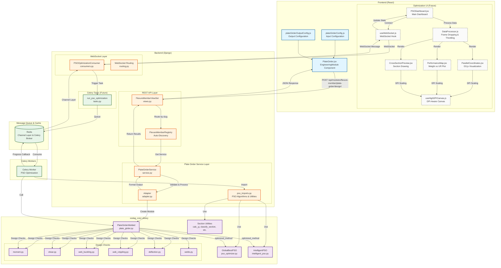
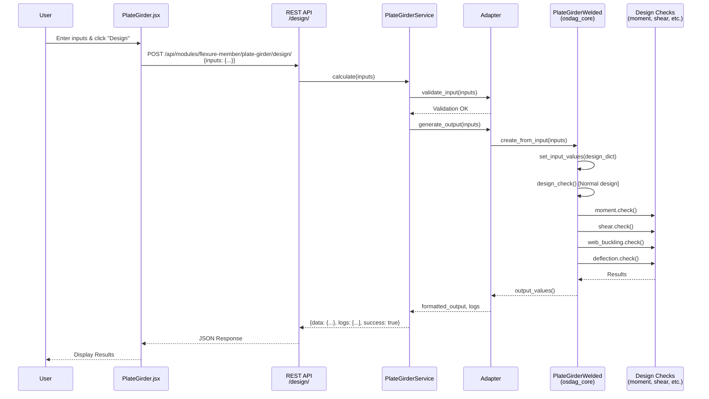
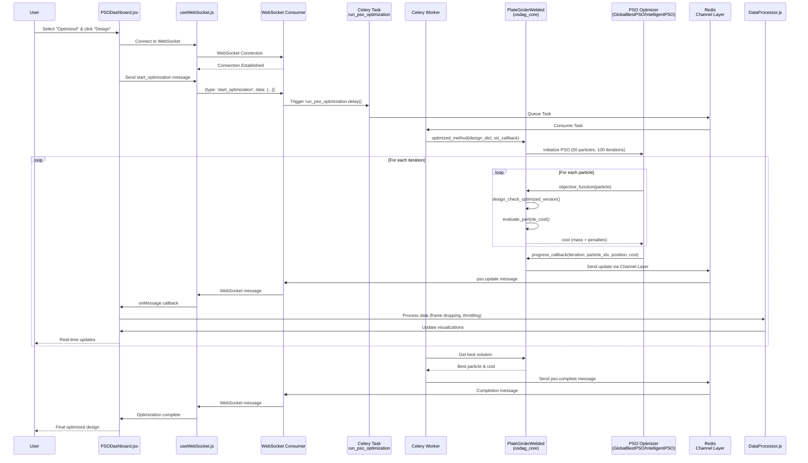
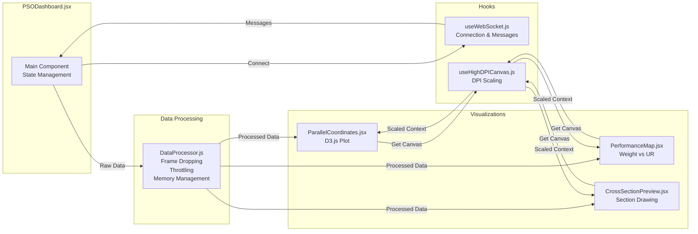
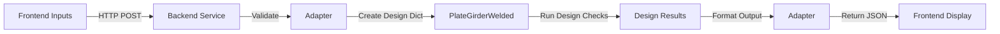
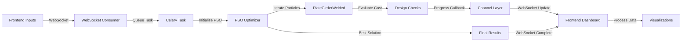
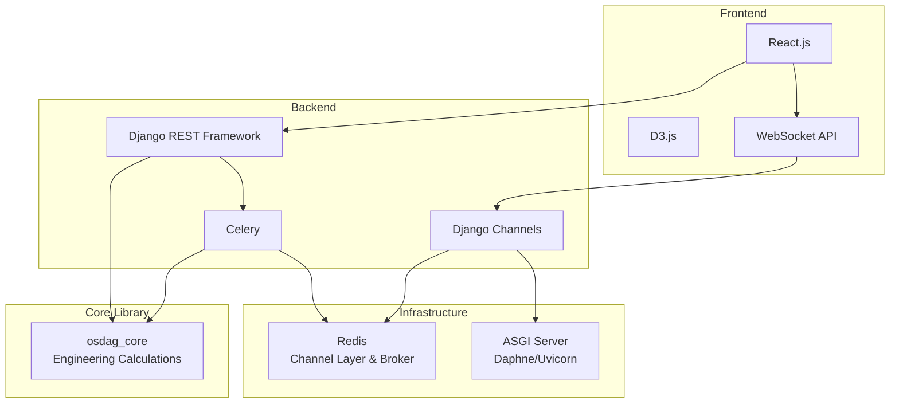

# Plate Girder Module - Architecture Diagram

## Complete System Architecture



## Detailed Flow Diagrams

### Flow 1: Normal (Non-Optimized) Design - REST API



### Flow 2: Optimized Design - PSO with WebSocket



### Flow 3: Component Interaction - Optimization Dashboard



### Flow 4: Backend Service Architecture

```mermaid
graph TB
    subgraph "API Layer"
        REST[REST Endpoints<br/>/design/<br/>/options/<br/>/cad/]
        WS_Endpoint[WebSocket Endpoint<br/>/ws/optimize/plate-girder/]
    end
    
    subgraph "Service Layer"
        Service[PlateGirderService<br/>calculate()<br/>get_options()<br/>get_cad_model()]
    end
    
    subgraph "Adapter Layer"
        Adapter[Adapter<br/>validate_input()<br/>generate_output()<br/>create_design_dictionary()<br/>create_cad_model()]
    end
    
    subgraph "Task Layer (Future)"
        Task[Celery Task<br/>run_pso_optimization()<br/>Throttling<br/>Heartbeat<br/>Error Handling]
    end
    
    subgraph "osdag_core Integration"
        PG[PlateGirderWelded<br/>set_input_values()<br/>design_check()<br/>output_values()<br/>optimized_method()]
        PSO_Imports[pso_imports.py<br/>GlobalBestPSO<br/>IntelligentPSO<br/>Section Utils]
    end
    
    REST --> Service
    WS_Endpoint --> Task
    Service --> Adapter
    Task --> PSO_Imports
    Task --> PG
    Adapter --> PG
    PSO_Imports --> PG
```

## Data Flow: Normal vs Optimized

### Normal Design Data Flow



### Optimized Design Data Flow



## Technology Stack



## Status Legend

- ✅ **Green/Completed**: Implemented and working
- 🟡 **Yellow/In Progress**: Partially implemented
- ❌ **Red/Not Started**: Not yet implemented
- ⚪ **Gray/Future**: Planned but not started

## Current Implementation Status

- ✅ **Phase 1**: Normal REST API Design - COMPLETE
- ✅ **Phase 2**: PSO Algorithms Import - COMPLETE
- ❌ **Phase 3**: Design Checks Import - NOT STARTED
- ❌ **Phase 4**: Plate Girder Core Optimization - NOT STARTED
- ❌ **Phase 5**: Celery Task - NOT STARTED
- ❌ **Phase 6**: Frontend WebSocket Infrastructure - NOT STARTED
- ❌ **Phase 7**: Frontend Visualization Components - NOT STARTED
- ❌ **Phase 8**: Integration - NOT STARTED
- ❌ **Phase 9**: Testing - NOT STARTED

