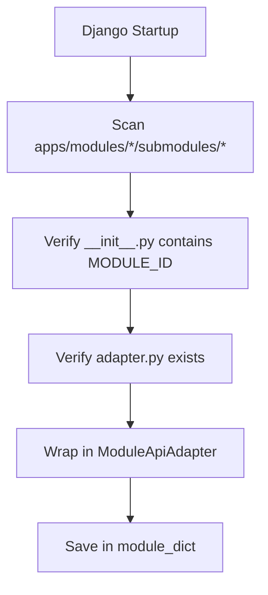

# Chapter 10: Modules Catalog & Status Directory

Osdag-Web organizes its engineering design modules into structured catalog directories. The catalog is rendered on the client side using configuration mappings and auto-discovered dynamically on the server side using adapter registries.

---

## 10.1 Active Modules Directory

Operational modules are rendered as card options on the homepage. Users can navigate to them to execute calculation parameters and compile 3D CAD graphics. Active routes and configs are configured in [modules.js](../frontend/src/constants/modules.js) and resolved via [ModulesCardLayout.jsx](../frontend/src/homepage/components/ModulesCardLayout.jsx).

The following table lists all active production modules in the system:

| Catalog Submodule | Card Label | Module Route Key | Frontend Route Path | Backend Adapter Registry |
| :--- | :--- | :--- | :--- | :--- |
| **Shear Connection** | Fin Plate | `FinPlateConnection` | `/design/connections/shear/fin_plate` | `apps.modules.shear_connection.submodules.fin_plate` |
| | Cleat Angle | `CleatAngleConnection` | `/design/connections/shear/cleat_angle` | `apps.modules.shear_connection.submodules.cleat_angle` |
| | End Plate | `EndPlateConnection` | `/design/connections/shear/end_plate` | `apps.modules.shear_connection.submodules.end_plate` |
| | Seated Angle | `SeatedAngleConnection` | `/design/connections/shear/seatAngle` | `apps.modules.shear_connection.submodules.seated_angle` |
| **Moment Connection** | Column Splices: Cover Plate (Bolted) | `ColumnColumnCoverPlateBolted` | `/design/connections/column-to-column-splice/cover_plate_bolted` | `apps.modules.moment_connection.submodules.column_column_cover_plate_bolted` |
| | Column Splices: Cover Plate (Welded) | `ColumnColumnCoverPlateWelded` | `/design/connections/column-to-column-splice/cover_plate_welded` | `apps.modules.moment_connection.submodules.column_column_cover_plate_welded` |
| | Column Splices: End Plate | `ColumnColumnEndPlateConnection` | `/design/connections/column-to-column-splice/end_plate` | `apps.modules.moment_connection.submodules.column_column_end_plate` |
| | Beam Splices: Cover Plate (Bolted) | `BeamBeamCoverPlateBolted` | `/design/connections/beam-to-beam-splice/cover_plate_bolted` | `apps.modules.moment_connection.submodules.beam_beam_cover_plate_bolted` |
| | Beam Splices: Cover Plate (Welded) | `BeamBeamCoverPlateWelded` | `/design/connections/beam-to-beam-splice/cover_plate_welded` | `apps.modules.moment_connection.submodules.beam_beam_cover_plate_welded` |
| | Beam Splices: End Plate | `BeamBeamEndPlateConnection` | `/design/connections/beam-to-beam-splice/end_plate` | `apps.modules.moment_connection.submodules.beam_beam_end_plate` |
| | Beam to Column: End Plate | `BeamColumnEndPlateConnection` | `/design/connections/column-beam/end_plate` | `apps.modules.moment_connection.submodules.beam_column_end_plate` |
| **Plated Connection** | Lap Joint — Bolted | `LapJointBolted` | `/design/connections/simple/lap_joint_bolted` | `apps.modules.simple_connection.submodules.lap_joint_bolted` |
| | Lap Joint — Welded | `LapJointWelded` | `/design/connections/simple/lap_joint_welded` | `apps.modules.simple_connection.submodules.lap_joint_welded` |
| | Butt Joint — Bolted | `ButtJointBolted` | `/design/connections/simple/butt_joint_bolted` | `apps.modules.simple_connection.submodules.butt_joint_bolted` |
| | Butt Joint — Welded | `ButtJointWelded` | `/design/connections/simple/butt_joint_welded` | `apps.modules.simple_connection.submodules.butt_joint_welded` |
| **Base Plate** | Slab & Gusseted Bases | `BasePlateConnection` | `/design/connections/base_plate` | `apps.modules.base_plate` |
| **Tension Member** | Bolted to End Gusset | `TensionBolted` | `/design/tension-member/bolted_to_end_gusset` | `apps.modules.tension_member.submodules.bolted` |
| | Welded to End Gusset | `TensionWelded` | `/design/tension-member/welded_to_end_gusset` | `apps.modules.tension_member.submodules.welded` |
| **Compression Member**| Struts Bolted to End Gusset | `StrutsBolted` | `/design/compression-member/struts_bolted_to_end_gusset` | `apps.modules.compression_member.submodules.struts_bolted` |
| | Struts Welded to End Gusset | `StrutsWelded` | `/design/compression-member/struts_welded_to_end_gusset` | `apps.modules.compression_member.submodules.struts_welded` |
| | Axially Loaded Column | `AxiallyLoadedColumn` | `/design/compression-member/axially_loaded_column` | `apps.modules.compression_member.submodules.axially_loaded_column` |
| **Flexure Member** | Simply Supported Beam | `SimplySupportedBeam` | `/design/flexure_member/simply_supported_beam` | `apps.modules.flexure_member.submodules.simply_supported_beam` |
| | Cantilever Beam | `OnCantilever` | `/design/flexure/on_cantilever` | `apps.modules.flexure_member.submodules.on_cantilever` |

---

## 10.2 Under-Development & Hidden Modules Directory

Several modules in the codebase are disabled, hidden, or lack complete integration routes.

### 1. Tab-Level Disabled Submodules
Certain connection submodules are registered in catalog definitions but marked as disabled within [ModulesCardLayout.jsx](../frontend/src/homepage/components/ModulesCardLayout.jsx) to prevent user navigation:
* **Truss Connections**: The `"Truss"` tab under the Connections category is explicitly flagged as `isDisabled = key === "Truss";` in the layout, returning a grayed-out non-clickable tab button.
* **Pre-Engineered Buildings (PEB)**: In the Moment Connections tab, the `"PEB"` sub-submodule button is explicitly disabled via the check `label === "PEB"` to prevent user entry.

### 2. Missing Route-Level Inactive Modules
* **Plate Girder**: Under the Flexure Member submodule tab, "Plate Girder" is listed as a card selection in `GENERIC_SUBMODULE_CONTENT`, but lacks a routing entry in `MODULE_ROUTES`. Clicking the card does not navigate the client.

### 3. Hidden Route-Only Modules
* **Purlin**: The `/design/flexure/purlin` route is configured in `MODULE_ROUTES` and points to a backend module adapter (`apps.modules.flexure_member.submodules.purlin`), but the card has been omitted from `GENERIC_SUBMODULE_CONTENT` list, making the module hidden from the homepage view.

### 4. Backend-Only Adapters (Omitted from UI)
* **Cantilever Connection (Shear)**: The directory `apps.modules.shear_connection.submodules.cantilever` registers a backend adapter (`adapter.py`) containing design validation, output generation, and CAD compilation code, but lacks a corresponding frontend configuration card or router mapping.

---

## 10.3 Backend Adapter & Auto-Discovery Registry

The server dynamically tracks the active calculation catalog via [module_finder.py](../backend/apps/core/module_finder.py). When the Django backend initializes:



### 1. Dynamic Modules Discovery
Rather than maintaining static lists of active adapter files:
1. `_discover_modules()` reads parent directories inside `apps/modules`.
2. It recursively scans their child `submodules` folder.
3. For each subdirectory, it parses `__init__.py` (using a regex scanner on raw file content to prevent import-time side-effects) to locate the unique `MODULE_ID` string.
4. If an `adapter.py` file is present, it imports the adapter module.

### 2. The Module API Adapter
Discovered modules are wrapped inside a unified `ModuleApiAdapter` class which exposes the standard `ModuleApiType` interface:
* `validate_input(input_values)`: Validates input JSON schemas.
* `get_required_keys()`: Returns input parameters mandatory for desktop/web parity.
* `generate_output(input_values)`: Computes design outcomes and maps metrics to display labels.
* `create_cad_model(input_values, section, session)`: Generates 3D meshes as CAD BREP files.

### 3. Fallback Registry
For legacy calculation engines that have not yet been migrated to the new backend app structure, `get_module_api()` implements a fallback routine:
```python
if module_id in _module_dict:
    return _module_dict[module_id]
# Fall back to legacy registry
from osdag_api.module_finder import get_module_api as old_get_module_api
return old_get_module_api(module_id)
```
This guarantees backward compatibility with older desktop components while allowing new modules to register dynamically.

---

## 10.4 Observations & Areas of Improvement

Review of the modules catalog structure identified the following points:

### 1. Hardcoded UI Status Flags
Module availability is determined via hardcoded string checks in `ModulesCardLayout.jsx`:
```javascript
const isDisabled = key === "Truss";
// ...
disabled={label === "PEB"}
```
> [!WARNING]
> Hardcoding disabled statuses directly in visual component templates complicates changes. If "Truss" or "PEB" becomes active in a test environment, developers must modify core rendering components.
>
> **Recommended Fix**: Add an `active` or `status` flag directly within the database catalog entries or dynamic configuration registries (e.g. `status: "production" | "development"`), and read this flag in `ModulesCardLayout.jsx`.

### 2. Incomplete Route Cleanups
* `PlateGirder` lacks a router path, causing a silent failure (no feedback) when a user clicks the card on the homepage.
* **Recommended Fix**: Add a user-facing toast alert notifying the user that the module is under development, or filter out options that lack matching `MODULE_ROUTES` entries from the UI card lists automatically.
