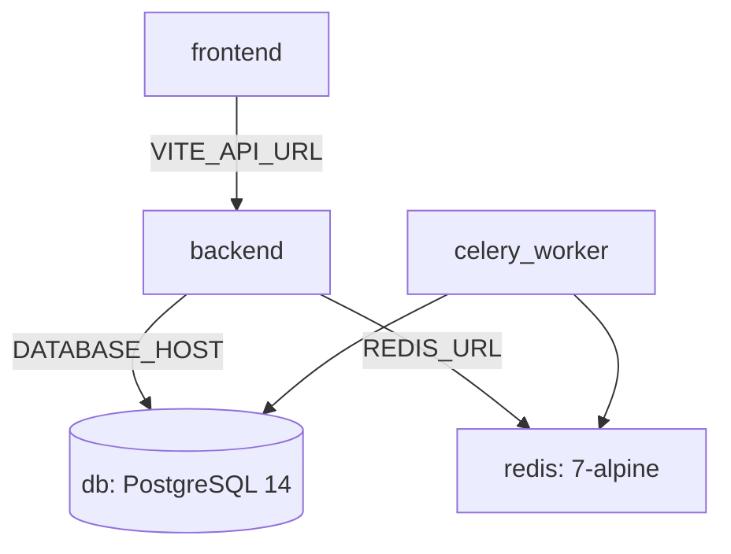

# Chapter 11: Local Conda Environment & Docker Containerization Setup

Osdag-Web supports two deployment topologies: a local Conda-based environment for development, and a containerized Docker topology optimized for high-concurrency production workloads.

---

## 11.1 Conda Environment Configuration

Osdag-Web relies on **pythonocc-core** (a Python wrapper for the OpenCASCADE 3D CAD kernel) to perform computational geometry calculations and render BREP/STL parts. Because pythonocc-core includes pre-compiled C++ binaries and graphic libraries, it is difficult to build from source via standard pip wrappers.

### 1. Local Environment Creation
Developers should use the Conda package manager to resolve system dependencies:
```bash
# Add the conda-forge channel for community-maintained packages
conda config --add channels conda-forge
conda config --set channel_priority strict

# Create the environment with pythonocc-core and cairo graphics bindings
conda create -n osdag-web python=3.11 pythonocc-core cairo -y

# Activate the environment
conda activate osdag-web

# Install Pip dependencies for backend web frameworks
pip install -r requirements.txt
```
The python packages installed via pip are registered in [requirements.txt](../requirements.txt).

### 2. Multi-Service Local Launcher
The local setup is managed using [osdagweb.sh](../osdagweb.sh). This script automates starting the system dependencies locally:
1. **Locates conda**: Iterates through candidate paths to load `conda.sh`.
2. **Starts Celery**: Launches the Celery worker process inside the `osdag-web` Conda environment.
3. **Starts Django**: Starts the Django development server on port 8000.
4. **Starts Vite**: Navigates to the frontend folder and launches the development client on port 5173.
5. **Handles Shutdown**: Registers a trap handler (`trap cleanup SIGINT SIGTERM`) to intercept interrupts, ensuring background processes are killed clean:
   ```bash
   cleanup() {
     for pid in "${PIDS[@]}"; do
       kill "$pid" 2>/dev/null
     done
     exit 0;
   }
   ```

---

## 11.2 Docker Containerization Architecture

Docker configurations split the application layers to ensure reproducible environments across production clusters.

### 1. Conceptual Introduction: Why Docker & Nginx?

For developers new to modern web systems, Osdag-Web utilizes **Docker** and **Nginx** to manage deployment environments and web traffic:

* **Why Docker?**
  * **Consistent Environments ("Works on My Machine")**: Docker wraps the entire application runtime environment (the OS kernel libraries, Python runtimes, LaTeX engines, OpenGL graphic libraries, and Node.js) into isolated packages called **Containers**. This ensures the code executes identically on a developer's local computer, a testing pipeline, or a production cloud cluster, preventing environment-specific compilation failures.
  * **Dependency Isolation**: It separates system-level tools. The backend container maintains its own isolated miniconda environment and C++ graphics wrappers without conflicting with the host system's local libraries.
  * **Service Orchestration**: Docker makes it simple to configure and spin up multiple services (PostgreSQL database, Redis cache, Django ASGI backend, specialized Celery workers, and Vite frontend) as a unified system using **Docker Compose**.

* **What is Nginx & Why Use It?**
  * **Nginx** is a high-performance web server and reverse proxy.
  * **Static File Serving**: In production, instead of running a resource-heavy Node.js server to host the React frontend, Nginx serves pre-compiled production HTML/JS/CSS assets directly. This provides high speed and low resource usage.
  * **Reverse Proxy Gateway**: Nginx acts as the primary entryway (Port 80) for user traffic. It intercepts requests: if a request is an API call (e.g. `/api`), it proxies (forwards) it internally to the Django backend; otherwise, it handles it as a frontend asset. This protects the internal backend ports from direct public exposures.

### 2. Backend & Worker Image Layout
The backend Docker container defined in [Dockerfile](../Dockerfile) is optimized for miniconda environment builds:
* **Base Image**: Built from `continuumio/miniconda3:24.11.1-0`.
* **System Libraries**: Installs `libpq-dev` (database bindings), `libgl1` and `libglu1-mesa` (OpenGL layers required by pythonocc-core), and LaTeX utilities (`wkhtmltopdf` and `texlive-latex-base`/`recommended`/`extra`) to compile calculation reports.
* **Conda Environment Compilation**:
  ```dockerfile
  RUN conda config --add channels conda-forge && \
      conda config --set channel_priority strict && \
      conda create -n osdag_env python=3.11 pythonocc-core cairo -y && \
      conda clean -afy
  ```
* **Security & Execution**: Pip packages from `requirements.txt` are installed directly inside the `osdag_env` environment. To prevent privilege escalation vulnerabilities, a non-root user `deployuser` (UID 8888) is created, and ownership of the app directory is assigned to this account before exposing port 8000.

### 3. Frontend Development & Production Images
The React Vite frontend uses two different Docker configurations:
* **Development [Dockerfile](../frontend/Dockerfile)**: Uses `node:20.11.1-alpine3.19` to install packages and starts the development server with hot module replacement (HMR).
* **Production [Dockerfile.prod](../frontend/Dockerfile.prod)**: Implements a multi-stage compilation:
  1. **Build Stage**: Uses `node:20-alpine` to run `npm run build`, outputting compiled assets to `/app/dist`.
  2. **Serving Stage**: Inherits from `nginx:alpine`, copies the static distribution folder from the build stage into Nginx's HTML directory, and sets Nginx as the entrypoint.

---

## 11.3 Development Orchestration (`docker-compose.yml`)

The multi-container development environment is defined in [docker-compose.yml](../docker-compose.yml). It coordinates five services:



### 1. Database & Cache Services
* **`db`**: Runs PostgreSQL 14 on container port 5432, mapping to host port 5433 to avoid conflicts. Declares the volume `postgres_data_dev` to persist transactional tables.
* **`redis`**: Instantiates a Redis 7 cache server to manage Celery task queues.

### 2. Django & Celery Integration
* **Shared Context**: Both `backend` and `celery_worker` build from the root `Dockerfile` and share the same environment variables.
* **Code Mounting**: The root project folder is mounted into the container workspace (`.:/app`) to enable code hot-reloading.
* **Initialization Commands**: The backend service runs migrations, seeds structural sections (`populate_database.py`), and executes ASGI-bound Gunicorn workers.

### 3. Frontend Integration
* **Polling Config**: Vite uses a polling driver (`CHOKIDAR_USEPOLLING: "true"`) to capture file modifications inside mounted container volumes.
* **Anonymous Volume Mount**: Mounts `/app/node_modules` anonymously to prevent local host dependencies from clobbering container node packages.

---

## 11.4 Production Orchestration (`docker-compose.prod.yml`)

The production deployment in [docker-compose.prod.yml](../docker-compose.prod.yml) isolates processes to achieve optimal thread utilization and stability.

```
+------------------------------------------------------------+
|                       Nginx Gateway                        |
|                         (Port 80)                          |
+---------+----------------------------+---------------------+
          | (Static/Media)             | (/api)
          v                            v
+------------------+         +------------------+
|  Static Volumes  |         |  Django Backend  |
+---------+--------+         +--------+---------+
          |                           | (Celery Tasks)
          |                           v
          |                  +------------------+
          |                  |   Redis Broker   |
          |                  +--------+---------+
          |                           |
          +----------------------+----+------------------+
                                 |                       |
                                 v                       v
                      +--------------------+   +--------------------+
                      | celery_worker_calc |   |  celery_worker_cad |
                      | (Concurrency: 18)  |   | (Max Tasks: 10/ch) |
                      +--------------------+   +--------------------+
```

### 1. Process and Volume Isolation
* **Nginx Reverse Proxy**: The frontend service serves compiled static HTML assets and acts as the entry gateway. It proxies API requests (`/api`) to the Django Gunicorn server.
* **Static Asset Persistence**: Declares dedicated volume mounts (`static_volume`, `media_volume`, `osifiles_volume`) shared between the backend, frontend, and Celery workers to store user calculations, reports, and CAD drawings.

### 2. Specialized Celery Worker Splits
To prevent heavy CPU computations or CAD rendering from blocking report generation, production workers are divided into three specialized service queues:

* **`celery_worker_calc`**:
  * **Queue**: `calculations`
  * **Concurrency**: `--concurrency=18`
  * **Rationale**: Designed for fast, CPU-bound calculation iterations. High concurrency permits processing multiple design requests simultaneously.
* **`celery_worker_cad`**:
  * **Queue**: `cad`
  * **Concurrency**: `--concurrency=8`
  * **Memory Limit**: `--max-tasks-per-child=10`
  * **Rationale**: CAD generation relies on C++ extensions loaded via pythonocc-core, which can leak memory over multiple operations. Restricting child lifetimes to a maximum of 10 tasks forces worker sub-processes to restart regularly, clearing residual allocations.
* **`celery_worker_reports`**:
  * **Queue**: `reports`
  * **Concurrency**: `--concurrency=4`
  * **Rationale**: Configured for LaTeX and PDF compilation tasks.

---

## 11.5 Observations & Areas of Improvement

Review of the Docker and environment orchestration structures highlights the following recommendations:

### 1. Hardcoded User ID Permissions
Both `backend` and `celery_worker` services inside `docker-compose.yml` declare a hardcoded user mapping:
```yaml
user: "1000:1000"
```
> [!WARNING]
> Mapping permissions to UID 1000 assumes that the host system developer has UID 1000. If run on a system where the developer account has a different UID (e.g. UID 1001), permission failures will occur when the container tries to write assets or logs into the mounted directory.
>
> **Recommended Fix**: Remove the hardcoded user attribute from development compose configurations, or pass the active UID as a variable inside the `.env` file (e.g. `user: "${HOST_UID}:${HOST_GID}"`).

**Resolution**: Resolved by updating `backend` and `celery_worker` service user mappings in [docker-compose.yml](../docker-compose.yml) to use environment variable interpolation with fallback: `user: "${HOST_UID:-1000}:${HOST_GID:-1000}"`.

### 2. Static Database Port Mappings
The database service maps PostgreSQL to host port 5433:
```yaml
ports:
  - "5433:5432"
```
> [!IMPORTANT]
> If a developer runs multiple local instances of Osdag-Web or has other local postgres services mapped to port 5433, container startup will fail due to port conflicts.
>
> **Recommended Fix**: Map database ports using environment variables (e.g. `ports: - "${DB_HOST_PORT:-5433}:5432"`) to allow dynamic port allocation.

**Resolution**: Resolved by modifying the `ports` attribute of the `db` service in [docker-compose.yml](../docker-compose.yml) to use environment variable interpolation with default fallback: `ports: - "${DB_HOST_PORT:-5433}:5432"`.

