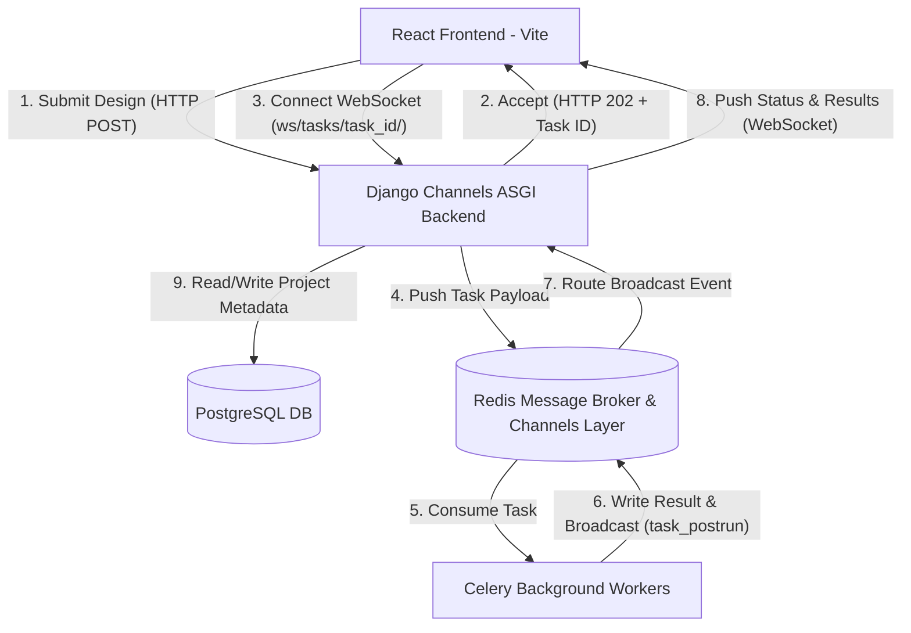
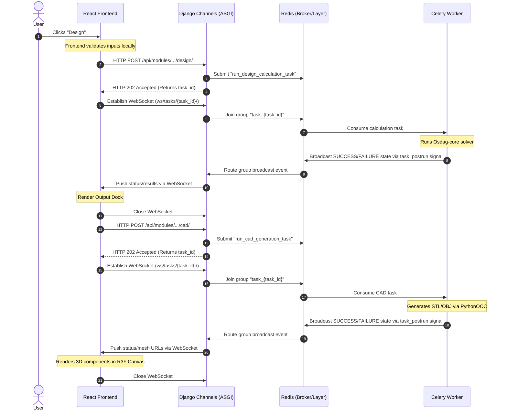

# Chapter 1: Architecture Overview & System Topology

Osdag-Web is designed as a modern, decoupled web application. It transitions the heavy, desktop-oriented CPU computations of the original Osdag suite into a responsive, scalable cloud architecture.

---

## 1.1 The Asynchronous Calculation Design Pattern

### The Problem
Structural engineering tasks—such as design calculations, 3D CAD model geometry compilation (using OpenCASCADE/PythonOCC), and PDF report compilation (using LaTeX)—are highly CPU-bound. If these computations were processed synchronously within Gunicorn or Uvicorn HTTP worker threads:
1. The web worker would be blocked for several seconds (or minutes) per request.
2. Under concurrent usage, all available web threads would quickly be exhausted.
3. This would lead to request timeouts, high latency, and complete unresponsiveness of the web app.

### The Asynchronous Solution
To decouple HTTP request handling from background calculation, Osdag-Web implements the **Asynchronous Calculation Design Pattern** using WebSockets:

1. **Immediate Acceptance:** When a user clicks **Design**, **CAD**, or **Generate Report**, the frontend submits the request payload via HTTP POST. The Django backend instantly generates a background job, submits it to a Celery task queue, and returns an `HTTP 202 Accepted` response with a unique `task_id` (taking <50ms).
2. **WebSocket Subscription:** The frontend intercepts the `task_id` and establishes a WebSocket connection to `/ws/tasks/{task_id}/`. Django Channels registers this WebSocket channel into a Redis channel group unique to the task (`task_{task_id}`).
3. **Execution & Push:** The Celery worker processes the computation out-of-process. When finished, a `task_postrun` signal handler broadcasts the final task state and results to the corresponding Redis channel group. Django Channels receives the event and immediately pushes the payload to the active WebSocket client, avoiding repetitive HTTP polling requests. The client updates the UI state and closes the connection.

---

## 1.2 The Osdag Input (.osi) File Exchange Format

### What is an .osi file?
An `.osi` (Osdag Input) file is the native file storage format of the Osdag suite. It is a plain-text key-value document mapping Osdag design parameter namespaces (like `Bolt.Diameter`) to their selected or custom values (like `[20]`). 

### The Exchange Mechanism
Osdag-Web maintains strict cross-compatibility with the Osdag desktop application through this format:
1. **Desktop-to-Web Import:** Users can upload a `.osi` file generated on the desktop application into Osdag-Web. The system parses the text file and populates the web-based input form docks instantly.
2. **Web-to-Desktop Export:** Authenticated users can save their project designs directly to the cloud database (which stores the inputs as an `OsiFile` model on the disk storage) or download the current inputs locally as a `.osi` file to open and review inside the Osdag desktop software.

---

## 1.3 System Component Topology

The Osdag-Web stack comprises five key components:

### 1. React Frontend (Vite)
* Renders the dynamic input/output docks, forms, and custom preferences.
* Manages local UI states via React Context (`ModuleState`, `GlobalState`).
* Integrates React Three Fiber (R3F) and Three.js to render interactive 3D CAD scenes.
* Manages client-side WebSocket connections to monitor task lifecycle and handles local file downloads (`.osi`, `.pdf`, `.dxf`, `.stp`).

### 2. Django ASGI Backend (Gunicorn + Uvicorn)
* Exposes the REST API endpoints for user authentication, project CRUD, option listings, and task triggers.
* Intercepts and validates Firebase identity tokens.
* Acts as the coordinator between PostgreSQL (relational state) and Redis/Celery (computation state).

### 3. Redis Message Broker & Result Backend
* **Message Broker:** Acts as the high-throughput queue manager storing Celery task payloads until consumed by workers.
* **Result Backend:** Stores transient task status metadata (e.g., `PENDING`, `SUCCESS`, `FAILURE`) and the serialized execution output data.

### 4. Celery Worker Pool
* A pool of independent worker processes running inside conda environments containing native C++ bindings (OpenCASCADE, Cairo).
* Executes the CPU-bound calculations, CAD model coordinate math, and LaTeX report builds.

### 5. PostgreSQL Relational Database
* Serves as the persistent source-of-truth for registered users and project histories.
* Stores project configurations, saved inputs (`inputs_json`), and previous calculation results (`outputs_json`).

---

## 1.4 Request Lifecycle Walkthrough

Here is the exact progression of a design and CAD workflow:

---

## 1.5 Architecture Assessment & Improvement Analysis

### 1. Security & Privacy Vulnerabilities
* **Anonymous Task Status Access:** The `TaskStatusAPIView` endpoint (`/api/tasks/<task_id>/`) is configured with `permission_classes = [AllowAny]`. While task IDs are generated as UUID4 (practically unguessable), this is an security-through-obscurity pattern. If a task ID is leaked or intercepted, an unauthenticated third-party can fetch the entire engineering inputs and outputs payload.
  * *Recommendation:* Update the backend status checker to require authentication and verify that the logged-in user owns the project associated with that task (if the task was triggered inside an authenticated session).

### 2. Network & Performance Overhead (Resolved)
* **Resource Waste from HTTP Polling [RESOLVED]:** Polling at 1s intervals generated significant HTTP overhead. This has been resolved by transitioning to a **WebSocket-based push model** using Django Channels and a Redis channel layer. Celery worker completion events (`task_postrun` signal) are dynamically broadcast to the active connection.
* **Celery Result Bloat in Redis [RESOLVED]:** Celery result storage was configured with `CELERY_RESULT_EXPIRES = 1800` in the settings, ensuring that finished task payloads are automatically purged after 30 minutes to manage the memory footprint.
