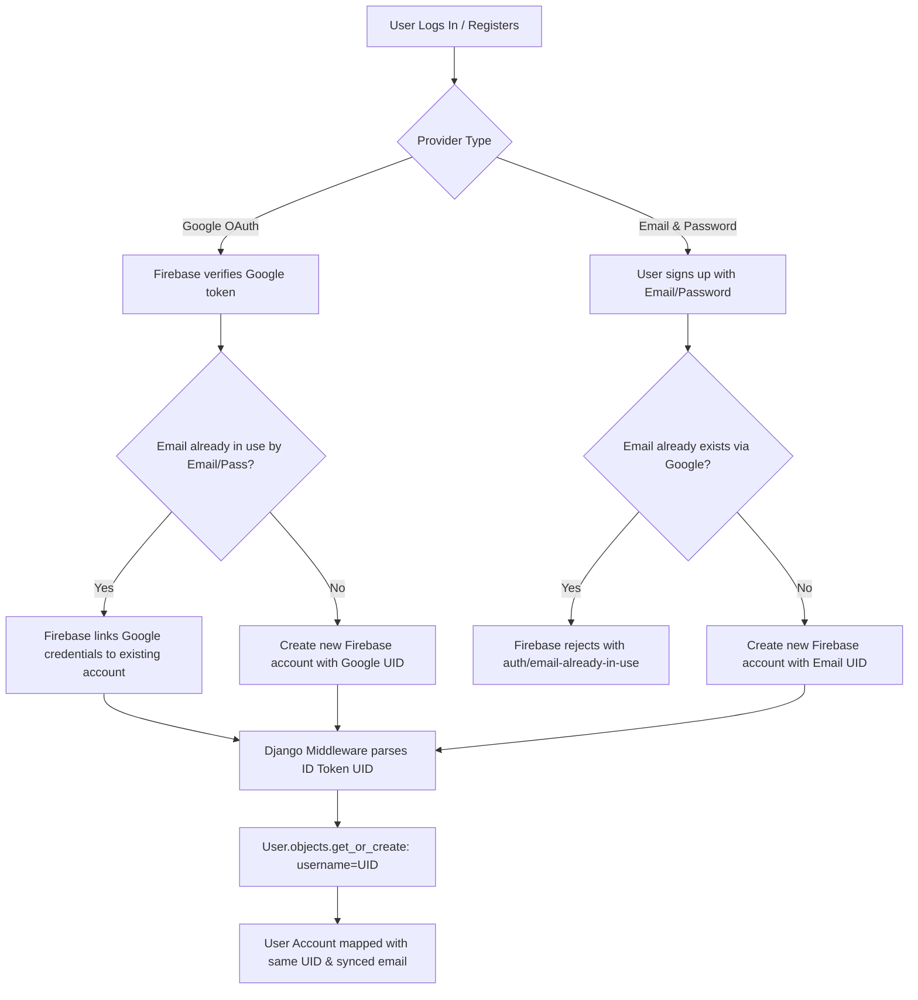

# Chapter 3: Authentication & Security System

Osdag-Web delegates user identity management to **Firebase Authentication** on the client side, while verifying credentials and enforcing permission boundaries on the Django backend.

---

## 3.1 Firebase Auth Integration

### 1. Client-Side Authentication Lifecycle
The frontend utilizes the Firebase Web SDK to perform actions such as sign-up, login, social logins (Google, GitHub), and email verification.
* Authenticated states are tracked via the `onAuthStateChanged` observer in [AuthContext.jsx](../frontend/src/context/AuthContext.jsx).
* The user's JWT ID Token is fetched dynamically before sending any authenticated API requests. If a request returns `HTTP 401 Unauthorized`, an interceptor in [apiClient.js](../frontend/src/utils/apiClient.js) automatically triggers a forced token refresh and retries the request seamlessly.

### 2. Django Token Verification (`FirebaseAuthentication` Middleware)
All protected backend REST endpoints require authentication headers formatted as:
`Authorization: Bearer <firebase_jwt_id_token>`

The custom DRF authentication class [FirebaseAuthentication](../backend/apps/core/middleware/firebase_auth.py) processes this token:
1. **Token Extraction:** Reads the `HTTP_AUTHORIZATION` header.
2. **Signature Verification:** Decodes the token using the Firebase Admin SDK (`firebase_auth.verify_id_token(token)`). This verifies the token’s cryptographic signatures against Firebase's public keys.
3. **Identity Syncing:**
   * Uses the Firebase `uid` to find or create a standard Django `User` object (where `username = Firebase UID`).
   * Syncs the user's `email` to both the Django `User` and custom `UserAccount` models.
4. **Metadata Attachment:** Attaches the `firebase_uid` and `email_verified` (boolean flag) to the Django `request` object.

---

## 3.2 User Account Management & Email Verification

Osdag-Web prevents spam and unverified database writes by enforcing email checks before saving designs to the database.

### 1. The `IsEmailVerified` DRF Permission Gate
The [IsEmailVerified](../backend/apps/core/permissions.py) class validates that the request initiator is both authenticated and has a verified email:
```python
class IsEmailVerified(permissions.BasePermission):
    def has_permission(self, request, view):
        if not request.user or not request.user.is_authenticated:
            return False
        # Checked via firebase_auth.verify_id_token claims
        return getattr(request, 'email_verified', False)
```

### 2. Action Blocking Rules
If a user is authenticated but has not clicked the email verification link:
* **Autosaving Projects:** Blocked with `HTTP 403 Forbidden` (`Please verify your email to create/save projects`).
* **Database OSI Saves:** Blocked at the `SaveOsiFromInputs` endpoint.

---

## 3.3 Guest Mode vs. Authenticated Mode

To encourage immediate engineering exploration, Osdag-Web implements a zero-barrier **Guest Mode**.

| Feature | Guest Mode | Authenticated (Verified) Mode |
|---------|------------|------------------------------|
| **Sign-In Required** | No (Anonymous sessions) | Yes (Firebase authenticated token) |
| **Project CRUD** | Disabled | Fully Enabled (saved in PostgreSQL) |
| **Calculations / CAD** | Fully Enabled (Celery) | Fully Enabled (Celery) |
| **OSI Save Format** | Client-side Base64 Download | Saved to DB (`OsiFile` model) & local download |
| **OSI Import** | File upload parsed in-memory | Project loaded from DB or direct upload |
| **Custom Materials** | Unavailable | Saved in `CustomMaterials` DB table |

---

## 3.4 Security Assessment & Scopes of Improvement

### 1. Performance Overhead of JWT Token Verification (Resolved)
* **The Problem:** Previously, in the backend middleware setup, `firebase_auth.verify_id_token(token)` was executed on every single incoming HTTP request. This added unnecessary latency (~15–50ms) to every request due to CPU-heavy cryptographic signature verification.
* **Resolution:** Implemented JWT session token caching using Django's cache framework (backed by Redis in production). When a Firebase token is verified, its metadata (UID, email, email_verified) is cached in Redis with a TTL matching the token's remaining expiration time (`exp - current_time`). Subsequent requests are authenticated using Redis lookups in <1ms, bypassing RSA signature verification entirely.

### 2. Outgoing Network Reliability Dependency (Accepted Risk)
* **The Problem:** If the server loses connection to the external internet or Firebase APIs (e.g., due to firewall blocks or public DNS failures), the Firebase Admin SDK cannot fetch verification public keys. This will cause all API requests to fail with `401 Unauthorized`.
* **Status:** Deferred/Accepted. Since Osdag-Web operates on a single baremetal setup and relies on external Firebase validation, local internet reliability is accepted as a prerequisite. If offline capability is needed in the future, transitioning to a local identity provider (like Keycloak or local Django authentication) will be required.

### 3. Logical Email Verification Bypasses (Resolved)
* **The Problem:** Previously, the `SaveOsiFromInputs` endpoint bypassed email verification checks when the `inline` flag was set to `True`, allowing authenticated users with unverified emails to generate OSI base64 content. Other endpoints like project listing, individual project deletion, and CAD calculations also lacked strict email verification checks for authenticated callers.
* **Resolution:** 
  - Implemented the `IsEmailVerifiedIfAuthenticated` permission class as the `DEFAULT_PERMISSION_CLASSES` in `settings.py` to globally secure all endpoints. Guest requests are permitted, but any authenticated request immediately checks and requires `request.email_verified` to be `True`.
  - Applied `IsEmailVerified` to user-centric views (`ProjectAPI`, `ProjectDetailAPI`, `ProjectByNameAPI`, `OpenOsiById`, `ProjectOsiDownload`, and `JWTHomeView`) to guarantee authenticated and verified access.
  - Removed redundant manual checks from individual view method bodies, relying on DRF's declarative permission lifecycle instead.

### 4. Cache Invalidation on Immediate Email Verification (Accepted Risk / Client Mitigation)
* **The Problem:** The backend middleware caches the token verification status (including `email_verified=False`) in Redis for performance. If a user registers, attempts an action (caching `email_verified=False`), and immediately clicks the verification link in their email, they would remain blocked during the active session:
  * Firebase ID tokens do not dynamically update their internal claims. The client will keep sending the same token.
  * Even if a fresh token could be obtained, if the backend uses the token string as the cache key, it reads the stale cache state until the Redis TTL expires.
* **Resolution/Mitigation:** 
  - The client-side application must force-refresh the Firebase token (`user.getIdToken(true)`) after email verification is completed.
  - The backend cache key is generated from a SHA-256 hash of the token string. Once the client forces a token refresh, a new token string is sent. This results in a cache miss, prompting the backend to verify the token with Firebase and update the cached verification state to `email_verified=True`.

### 5. Orphaned Database Records on Account Deletion (Accepted Risk / Future Work)
* **The Problem:** Osdag-Web currently does not provide an account deletion option in the frontend interface or backend REST views. If a user's account is deleted directly via Firebase Auth:
  * The Firebase `uid` is destroyed.
  * The Django `User`, `UserAccount`, and associated `Project` database tables will retain their records, leading to orphaned user data in PostgreSQL.
* **Resolution/Status:** Accepted risk. Individual project deletion is fully supported. For user account deletion, the proposed future work is to register a Firebase Cloud Function reacting to `functions.auth.user().onDelete()` that fires a secure webhook to the Django backend to cascade-delete all matching database records.

---

## 3.5 OAuth & Email/Password Provider Merging & Conflict Resolution

Osdag-Web supports signing in via Google (OAuth 2.0) and traditional Email/Password credentials. To prevent account duplicate bloat or authentication hijack, the system handles identity verification conflicts across both the client-side Firebase Auth layer and the backend Django model layer:



### 1. Conflict Resolution Scopes (Firebase Client Layer)
Firebase Authentication enforces the **"One account per email address"** rule at the project level, resolving conflicts depending on the registration sequence:
* **Scenario A: Email/Password First, Google Second**:
  If a user creates an account with `engineer@example.com` and password, and later clicks **"Login with Google"** using the same `engineer@example.com` Gmail account:
  * Since Google is a trusted identity provider that verifies emails, Firebase automatically **merges/links** the Google credential to the existing Email/Password user account.
  * The account retains the exact same Firebase `uid`.
* **Scenario B: Google First, Email/Password Second**:
  If a user signs up with **"Login with Google"** using `engineer@example.com`, and later tries to register a new account on the signup form using the same `engineer@example.com` email and a password:
  * Firebase rejects the signup request, throwing the error `auth/email-already-in-use`.
  * The frontend client intercepts this error in `firebaseAuth.js` via `getFirebaseErrorMessage` and shows a user-friendly instruction: *"This email is already registered. Please log in or use 'Login with Google'"*, blocking duplicate creation.

### 2. Backend Conflict Resolution (Django Middleware Layer)
The Django backend is agnostic of the sign-in provider (Google vs. Email/Password). It only receives and cryptographically validates the Firebase ID token.
* **UID as the Primary Identifier**:
  The custom `FirebaseAuthentication` middleware uses the Firebase `uid` claim as the Django `username` to create or retrieve accounts:
  ```python
  user, created = User.objects.get_or_create(
      username=uid,
      defaults={'email': email or ''}
  )
  ```
  Because Firebase links both providers under the **same UID** in the scenarios above, the Django middleware always maps the user to the same Django `User` and `UserAccount` records. No duplicate entries or conflict warnings are generated in the PostgreSQL database.
* **Dynamic Email Syncing**:
  If the user's email was updated or linked during the authentication step, the Django middleware automatically updates the database models:
  ```python
  if email and user.email != email:
      user.email = email
      user.save()
  ```


