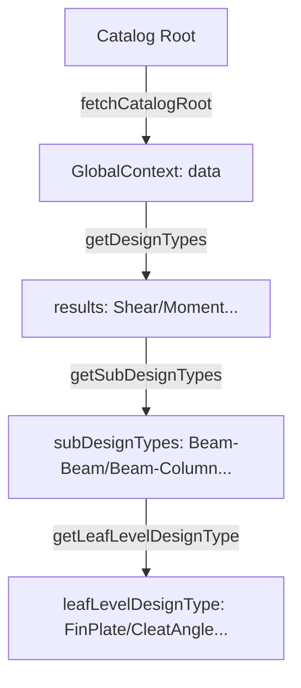
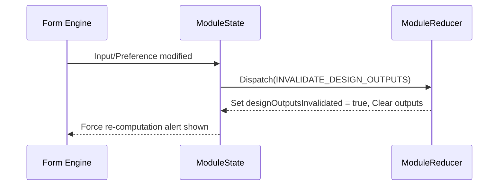

# Chapter 8: Frontend State Management Architecture

Osdag-Web implements a modular state management architecture designed to coordinate complex engineering inputs, asynchronous design computations, real-time 3D CAD visualization, and user configuration preferences. State is bifurcated into a lightweight global catalog shell and a highly specialized design module engine.

---

## 8.1 Global Application Context

The global application context coordinates identity verification (described in Chapter 3), homepage directory routing, and active connection subcategory listing.

### Catalog Selection Tree State
Implemented in [GlobalState.jsx](../frontend/src/context/GlobalState.jsx) and parsed through [AppReducer.jsx](../frontend/src/context/AppReducer.jsx), this context handles the tree traversal of the connections catalog.



* **`data`**: Initial root array holding primary catalog categories fetched from backend option endpoints.
* **`results`**: Structural connection types mapped to the active root selection (e.g., Moment Connection, Shear Connection, Tension Member, Truss Connection).
* **`subDesignTypes` & `leafLevelDesignType`**: Deep-tree state variables identifying exact engineering specifications and routing endpoints.
* **`fetch_cache`**: String representation of the last connectivity URL fetched, preventing repetitive network round-trips when components trigger page updates.

---

## 8.2 ModuleState & ModuleReducer Deep Dive

The core of Osdag-Web's state resides in the module context. Declared in [ModuleState.jsx](../frontend/src/context/ModuleState.jsx) and processed via [ModuleReducer.jsx](../frontend/src/context/ModuleReducer.jsx), this state machine manages the database drop-down arrays, active engineering calculations, CAD model variables, and overridden preference configurations.

### 1. State Variables Architecture
* **Structural Drop-downs**: State arrays like `beamList`, `columnList`, `materialList`, `boltDiameterList`, `thicknessList`, `propertyClassList`, `angleList`, and `weldSizeList` are populated based on the active connection type.
* **Design Output & Logs**:
  * `designData`: Evaluated computational results returned by Django adapters.
  * `designLogs`: Iterative warning and validation logs parsed during python execution.
  * `displayPDF` & `blobUrl`: State controlling report preview rendering.
* **CAD Path Mapping**:
  * `renderCadModel`: Boolean flag indicating to the React Three Fiber (R3F) canvas that geometry calculations are complete.
  * `cadModelPaths`: Map storing absolute static paths to generated BREP/STL parts.
  * `hoverDict`: Map linking component parts (e.g., `Beam`, `Column`, `Plate`, `Weld`) to dimensions and hover metadata.
* **Design Preferences Snapshotting**:
  * `designPrefData`: The server-side default and loaded preference properties.
  * `lastKnownGoodDesignPrefSnapshot`: Fallback snapshot representing the last successfully validated synchronization state.
  * `designOutputsInvalidated`: Flag indicating that the user updated preferences or driving variables after a design computation, prompting a recalculation.

### 2. Module Context API
The state provider exposes 8 core callbacks to coordinate design module operations:

| Callback Function | Description | Core Operations |
| :--- | :--- | :--- |
| `getModuleData` | Universal options fetcher. | Queries `/options/` to populate all drop-down and material lists for a module in a single request. |
| `getConnectivityData` | Connectivity lists loader. | Filters listings based on beam-to-column or beam-to-beam orientation rules. |
| `manageCustomMaterials` | Custom section register. | Dispatches updates to state caches and triggers option refetches. |
| `createDesign` | Computation orchestrator. | Coordinates inputs submission and dispatches output state saves. |
| `createCADModel` | CAD model compiler. | Sends verified inputs to CAD engines and dispatches paths and `hoverDict`. |
| `downloadCADModel` | Export helper. | Downloads compiled assemblies in STEP, IGES, or STL formats. |
| `generateReport` | Report exporter. | Generates download links for PDF or CSV representations of calculated values. |
| `manageDesignPreferences` | Configuration synchronizer. | Modifies section properties and material limits. |

### 3. Design Output Invalidation Flow
When a user updates overrides or driving dimensions *after* running calculations, the output becomes invalid. To guarantee consistency:
1. Submitting preferences or changes in material inputs dispatches `INVALIDATE_DESIGN_OUTPUTS`.
2. The reducer clears `designData`, `designLogs`, `cadModelPaths`, `hoverDict`, and sets `renderCadModel = false`.
3. The state flags `designOutputsInvalidated = true`.
4. The frontend UI displays helper prompts signaling to the engineer that design recalculations are needed.



### 4. Strict Linked Reseed Pattern (`APPLY_STRICT_LINKED_RESEED`)
Updates to parent input components (e.g., Column Section Material) trigger linked changes. To keep overridden configurations valid, the reseed logic updates matching fields in the additional inputs context without clearing overrides of independent components.

---

## 8.3 Hooks Architecture

Osdag-Web encapsulates business logic in custom React hooks to isolate DOM rendering from computations.

```
+-------------------------------------------------------------+
|                     useEngineeringModule                    |
|  (Central Orchestrator)                                     |
+--------+-----------------+------------------+---------------+
         |                 |                  |
         v                 v                  v
+-----------------+ +-------------+ +-------------------------+
|  useModuleForm  | |useModuleData| |   useDesignSubmission   |
|  (Input Form)   | |(API Lists)  | |  (Calculations / CAD)   |
+--------+--------+ +-------------+ +------------+------------+
         |                                       |
         v                                       v
+-----------------+                 +-------------------------+
|useDesignPrefSync|                 |  DESIGN_STATUS Machine  |
| (Sync Material) |                 |  (IDLE -> VALIDATING...)|
+-----------------+                 +-------------------------+
```

### 1. `useEngineeringModule.js`
The main orchestrator. It imports context APIs and initiates local state coordinators:
* Loads data via `useModuleData`.
* Coordinates forms and preferences overrides via `useModuleForm`.
* Executes submissions and monitors progress via `useDesignSubmission`.
* Integrates `useDependentData` and `useDesignPrefSync` hooks to track input changes.
* Evaluates change states to block navigation via `useNavigationGuard`.

### 2. `useModuleForm.js`
Manages inputs, dropdown choices, customization selection checkboxes, and modal overlays:
* **OSI Loading**: Uses `loadStateFromOsi` on initial render to translate and map imported file keys to React forms.
* **Default Seeding**: Ensures dropdown selectors fallback to first available database options if not prefilled.
* **Overrides Cache**: Stores temporary preferences modifications within `designPrefOverrides` prior to submission.

### 3. `useDesignSubmission.js`
Manages the validation and asynchronous execution pipeline. It models state updates using the `DESIGN_STATUS` state machine:

```javascript
export const DESIGN_STATUS = {
  IDLE: 'IDLE',
  VALIDATING: 'VALIDATING',
  CALCULATING: 'CALCULATING',
  CAD_GENERATING: 'CAD_GENERATING',
  COMPLETE: 'COMPLETE',
  ERROR: 'ERROR'
};
```

#### The Submission Pipeline
1. **Validate**: Iterates through `inputSections`, checking for missing fields. Checks conditional logic rules to skip inactive inputs and validates custom options checklist counts.
2. **Build Parameters**: Triggers `buildSubmissionParams` mapping form units into backend-compatible structures.
3. **Calculate**: Enters `CALCULATING`, invoking `service.createDesign`. Checks response variables for safe/unsafe status flags.
4. **Persist**: If a `projectId` is present, it calls `service.updateProject` to save inputs and results into the PostgreSQL database.
5. **CAD Build**: Enters `CAD_GENERATING` and calls `service.createCADModel`. Returns generated files, updates `cadModelPaths`, and registers `hoverDict` tooltips.
6. **Finalize**: Transition to `COMPLETE`, resetting the status to `IDLE` after 1 second.

### 4. `useDependentData.js`
Listens for changes to structural section profiles and designations. When values are modified, it queries the `/design-preferences/` endpoint to retrieve physical dimensions, mechanical limits, and thickness attributes needed for validation.

### 5. `useDesignPrefSync.js`
Acts as a passive material parity synchronizer. It listens to dock drivers (e.g., `connector_material`) and sends sync calls to the backend. It merges returned values back into input fields via `mergeLinkedParityKeysIntoInputs`.

---

## 8.4 Observations & Areas of Improvement

During the code review of Osdag-Web's state architecture, several design anti-patterns and performance bottlenecks were identified:

### 1. Global State Cache Mutation
In `GlobalState.jsx`, the request cache tracker is modified via direct object property mutation:
```javascript
const getDesignTypes = async (conn_type) => {
  const URL_KEY = `designTypes:${conn_type}`;
  if (initialValue.fetch_cache === URL_KEY) return;
  initialValue.fetch_cache = URL_KEY; // Direct mutation of configuration object
  // ...
};
```
> [!WARNING]
> Directly mutating `initialValue.fetch_cache` bypasses React's render cycles. If multiple catalog selectors are mounted, it may cause cache-clobbering and state race conditions.
>
> **Recommended Fix**: Implement the cache variable inside a React `useRef` or local state.

### 2. Redundant Legacy Reducer Actions
`ModuleReducer.jsx` retains several redundant legacy actions alongside consolidated ones:
* `SAVE_CM_DETAILS`, `SAVE_SDM_DETAILS`, and `SAVE_STM_DETAILS` perform isolated updates that are already handled by `SAVE_MATERIAL_DETAILS`.
* `UPDATE_SUPPORTING_ST_DATA` and `UPDATE_SUPPORTED_ST_DATA` duplicate calculations that are unified under `UPDATE_SECTION_DATA`.
> [!NOTE]
> Maintaining deprecated reducer branches increases bundle size and complicates codebase audits. These legacy functions should be removed.

### 3. Typing-Induced Network Spams in Dependent Data
In `useDependentData.js`, state updates on input parameters trigger immediate API requests:
```javascript
useEffect(() => {
  loadSupportedData();
}, [inputs.section_designation, inputs.member_designation, inputs.section_profile]);
```
> [!IMPORTANT]
> If a user enters text or toggles custom section parameters rapidly, this useEffect fires multiple API queries concurrently. This can lead to database connection bottlenecks.
>
> **Recommended Fix**: Add a debounce delay of 250ms to `useDependentData` before firing backend API fetches.

### 4. OSI Prefill Timing Race Hazard
In `useModuleForm.js`, imported OSI files prefill forms via a sessionStorage hook. Once loaded, the code deletes the session cache using a fixed timeout:
```javascript
if (hasLoadedLists) {
  setTimeout(() => {
    sessionStorage.removeItem(`prefill:${moduleKey}`);
  }, 1000); // Arbitrary timeout
}
```
> [!CAUTION]
> If API network requests for dropdown options take longer than 1000ms (due to high database load), the prefill storage is cleared *before* form inputs map to their corresponding list values. This results in form inputs reverting to empty selections.
>
> **Recommended Fix**: Clear the prefill cache only after the parent list options are successfully loaded and the inputs are mapped.
