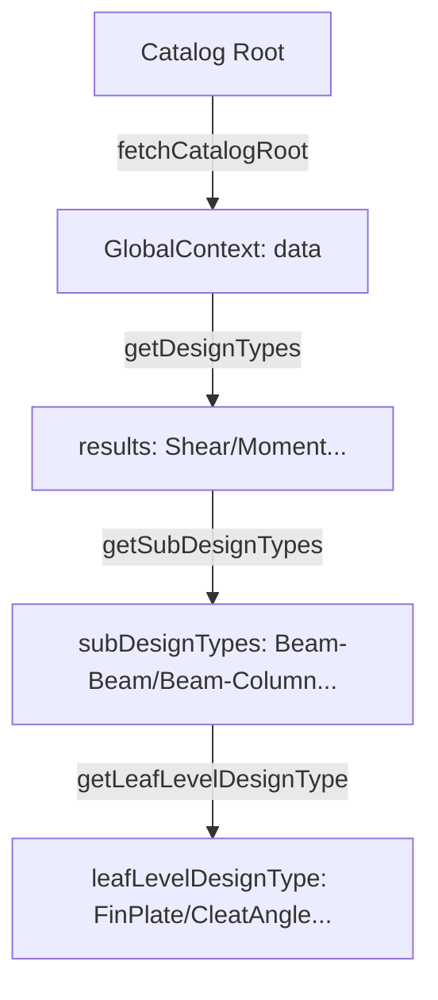
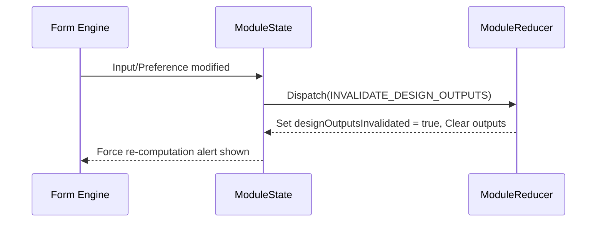

# Chapter 8: Frontend State Management Architecture

Osdag-Web implements a modular state management architecture designed to coordinate complex engineering inputs, asynchronous design computations, real-time 3D CAD visualization, and user configuration preferences. State is bifurcated into a lightweight global catalog shell and a highly specialized design module engine.

---

## 8.1 Global Application Context

The global application context coordinates identity verification (described in Chapter 3), homepage directory routing, and active connection subcategory listing.

### Catalog Selection Tree State
Implemented in [GlobalState.jsx](../frontend/src/context/GlobalState.jsx) and parsed through [AppReducer.jsx](../frontend/src/context/AppReducer.jsx), this context handles the tree traversal of the connections catalog.



* **`data`**: Initial root array holding primary catalog categories fetched from backend option endpoints.
* **`results`**: Structural connection types mapped to the active root selection (e.g., Moment Connection, Shear Connection, Tension Member, Truss Connection).
* **`subDesignTypes` & `leafLevelDesignType`**: Deep-tree state variables identifying exact engineering specifications and routing endpoints.
* **`fetch_cache`**: String representation of the last connectivity URL fetched, preventing repetitive network round-trips when components trigger page updates.

---

## 8.2 ModuleState & ModuleReducer Deep Dive

The core of Osdag-Web's state resides in the module context. Declared in [ModuleState.jsx](../frontend/src/context/ModuleState.jsx) and processed via [ModuleReducer.jsx](../frontend/src/context/ModuleReducer.jsx), this state machine manages the database drop-down arrays, active engineering calculations, CAD model variables, and overridden preference configurations.

### 1. State Variables Architecture
* **Structural Drop-downs**: State arrays like `beamList`, `columnList`, `materialList`, `boltDiameterList`, `thicknessList`, `propertyClassList`, `angleList`, and `weldSizeList` are populated based on the active connection type.
* **Design Output & Logs**:
  * `designData`: Evaluated computational results returned by Django adapters.
  * `designLogs`: Iterative warning and validation logs parsed during python execution.
  * `displayPDF` & `blobUrl`: State controlling report preview rendering.
* **CAD Path Mapping**:
  * `renderCadModel`: Boolean flag indicating to the React Three Fiber (R3F) canvas that geometry calculations are complete.
  * `cadModelPaths`: Map storing absolute static paths to generated BREP/STL parts.
  * `hoverDict`: Map linking component parts (e.g., `Beam`, `Column`, `Plate`, `Weld`) to dimensions and hover metadata.
* **Design Preferences Snapshotting**:
  * `designPrefData`: The server-side default and loaded preference properties.
  * `lastKnownGoodDesignPrefSnapshot`: Fallback snapshot representing the last successfully validated synchronization state.
  * `designOutputsInvalidated`: Flag indicating that the user updated preferences or driving variables after a design computation, prompting a recalculation.

### 2. Module Context API
The state provider exposes 8 core callbacks to coordinate design module operations:

| Callback Function | Description | Core Operations |
| :--- | :--- | :--- |
| `getModuleData` | Universal options fetcher. | Queries `/options/` to populate all drop-down and material lists for a module in a single request. |
| `getConnectivityData` | Connectivity lists loader. | Filters listings based on beam-to-column or beam-to-beam orientation rules. |
| `manageCustomMaterials` | Custom section register. | Dispatches updates to state caches and triggers option refetches. |
| `createDesign` | Computation orchestrator. | Coordinates inputs submission and dispatches output state saves. |
| `createCADModel` | CAD model compiler. | Sends verified inputs to CAD engines and dispatches paths and `hoverDict`. |
| `downloadCADModel` | Export helper. | Downloads compiled assemblies in STEP, IGES, or STL formats. |
| `generateReport` | Report exporter. | Generates download links for PDF or CSV representations of calculated values. |
| `manageDesignPreferences` | Configuration synchronizer. | Modifies section properties and material limits. |

### 3. Design Output Invalidation Flow
When a user updates overrides or driving dimensions *after* running calculations, the output becomes invalid. To guarantee consistency:
1. Submitting preferences or changes in material inputs dispatches `INVALIDATE_DESIGN_OUTPUTS`.
2. The reducer clears `designData`, `designLogs`, `cadModelPaths`, `hoverDict`, and sets `renderCadModel = false`.
3. The state flags `designOutputsInvalidated = true`.
4. The frontend UI displays helper prompts signaling to the engineer that design recalculations are needed.



### 4. Strict Linked Reseed Pattern (`APPLY_STRICT_LINKED_RESEED`)
Updates to parent input components (e.g., Column Section Material) trigger linked changes. To keep overridden configurations valid, the reseed logic updates matching fields in the additional inputs context without clearing overrides of independent components.

---

## 8.3 Hooks Architecture

Osdag-Web encapsulates business logic in custom React hooks to isolate DOM rendering from computations.

```
+-------------------------------------------------------------+
|                     useEngineeringModule                    |
|  (Central Orchestrator)                                     |
+--------+-----------------+------------------+---------------+
         |                 |                  |
         v                 v                  v
+-----------------+ +-------------+ +-------------------------+
|  useModuleForm  | |useModuleData| |   useDesignSubmission   |
|  (Input Form)   | |(API Lists)  | |  (Calculations / CAD)   |
+--------+--------+ +-------------+ +------------+------------+
         |                                       |
         v                                       v
+-----------------+                 +-------------------------+
|useDesignPrefSync|                 |  DESIGN_STATUS Machine  |
| (Sync Material) |                 |  (IDLE -> VALIDATING...)|
+-----------------+                 +-------------------------+
```

### 1. `useEngineeringModule.js`
The main orchestrator. It imports context APIs and initiates local state coordinators:
* Loads data via `useModuleData`.
* Coordinates forms and preferences overrides via `useModuleForm`.
* Executes submissions and monitors progress via `useDesignSubmission`.
* Integrates `useDependentData` and `useDesignPrefSync` hooks to track input changes.
* Evaluates change states to block navigation via `useNavigationGuard`.

### 2. `useModuleForm.js`
Manages inputs, dropdown choices, customization selection checkboxes, and modal overlays:
* **OSI Loading**: Uses `loadStateFromOsi` on initial render to translate and map imported file keys to React forms.
* **Default Seeding**: Ensures dropdown selectors fallback to first available database options if not prefilled.
* **Overrides Cache**: Stores temporary preferences modifications within `designPrefOverrides` prior to submission.

### 3. `useDesignSubmission.js`
Manages the validation and asynchronous execution pipeline. It models state updates using the `DESIGN_STATUS` state machine:

```javascript
export const DESIGN_STATUS = {
  IDLE: 'IDLE',
  VALIDATING: 'VALIDATING',
  CALCULATING: 'CALCULATING',
  CAD_GENERATING: 'CAD_GENERATING',
  COMPLETE: 'COMPLETE',
  ERROR: 'ERROR'
};
```

#### The Submission Pipeline
1. **Validate**: Iterates through `inputSections`, checking for missing fields. Checks conditional logic rules to skip inactive inputs and validates custom options checklist counts.
2. **Build Parameters**: Triggers `buildSubmissionParams` mapping form units into backend-compatible structures.
3. **Calculate**: Enters `CALCULATING`, invoking `service.createDesign`. Checks response variables for safe/unsafe status flags.
4. **Persist**: If a `projectId` is present, it calls `service.updateProject` to save inputs and results into the PostgreSQL database.
5. **CAD Build**: Enters `CAD_GENERATING` and calls `service.createCADModel`. Returns generated files, updates `cadModelPaths`, and registers `hoverDict` tooltips.
6. **Finalize**: Transition to `COMPLETE`, resetting the status to `IDLE` after 1 second.

### 4. `useDependentData.js`
Listens for changes to structural section profiles and designations. When values are modified, it queries the `/design-preferences/` endpoint to retrieve physical dimensions, mechanical limits, and thickness attributes needed for validation.

### 5. `useDesignPrefSync.js`
Acts as a passive material parity synchronizer. It listens to dock drivers (e.g., `connector_material`) and sends sync calls to the backend. It merges returned values back into input fields via `mergeLinkedParityKeysIntoInputs`.

---

## 8.4 Observations & Areas of Improvement

During the code review of Osdag-Web's state architecture, several design anti-patterns and performance bottlenecks were identified and resolved:

### 1. Global State Cache Mutation (Resolved)
* **The Problem:** In `GlobalState.jsx`, the request cache tracker was modified via direct object property mutation on `initialValue.fetch_cache`, bypassing React's render cycles.
* **The Risk:** If multiple catalog selectors were mounted, it could cause cache-clobbering and state race conditions.
* **Resolution:** Replaced the direct mutation of `initialValue.fetch_cache` with a React `useRef` (`fetchCacheRef`) inside the [GlobalProvider](file:///home/abhijith/coding/osdag/Osdag-web/frontend/src/context/GlobalState.jsx#L23-L45) to manage the request cache state synchronously and safely.

### 2. Redundant Legacy Reducer Actions (Resolved)
* **The Problem:** `ModuleReducer.jsx` retained several redundant legacy actions (`SAVE_CM_DETAILS`, `SAVE_SDM_DETAILS`, `SAVE_STM_DETAILS`, `UPDATE_SUPPORTING_ST_DATA`, `UPDATE_SUPPORTED_ST_DATA`, and `UPDATE_MATERIAL_FROM_CACHES`) alongside consolidated ones.
* **The Risk:** Maintaining deprecated reducer branches increased bundle size and complicated codebase audits.
* **Resolution:** Completely purged all deprecated legacy actions from [ModuleReducer.jsx](file:///home/abhijith/coding/osdag/Osdag-web/frontend/src/context/ModuleReducer.jsx#L140-L190). Refactored [ModuleState.jsx](file:///home/abhijith/coding/osdag/Osdag-web/frontend/src/context/ModuleState.jsx#L170-L195) to dispatch unified actions (`SAVE_MATERIAL_DETAILS` and `UPDATE_SECTION_DATA`).

### 3. Typing-Induced Network Spams in Dependent Data (Resolved)
* **The Problem:** In `useDependentData.js`, state updates on input parameters triggered immediate API requests.
* **The Risk:** Rapid typing or section updates fired multiple API queries concurrently, leading to database connection bottlenecks.
* **Resolution:** Integrated a 250ms debounce window using `setTimeout` and `clearTimeout` inside the API query `useEffect` hooks in [useDependentData.js](file:///home/abhijith/coding/osdag/Osdag-web/frontend/src/modules/shared/hooks/useDependentData.js#L10-L100) to aggregate rapid input events before triggering backend queries.

### 4. OSI Prefill Timing Race Hazard (Resolved)
* **The Problem:** In `useModuleForm.js`, imported OSI files prefilled forms via a session storage loader. Once loaded, the cache was deleted using a fixed 1000ms timeout.
* **The Risk:** If options API fetches took longer than 1000ms, the prefill session storage was cleared before inputs were mapped, causing inputs to revert to empty.
* **Resolution:** Bound the prefill cache clearing to options readiness (`hasLoadedLists`) inside the prefill loader effect in [useModuleForm.js](file:///home/abhijith/coding/osdag/Osdag-web/frontend/src/modules/shared/hooks/useModuleForm.js#L90-L117). The session cache is now cleared synchronously only after options are successfully populated.

### 5. Pervasive Debug `console.log` Statements Left in Production Code (Resolved)
* **The Problem:** Multiple files contained debug-only `console.log` statements that fired on high-frequency paths (reducers, state providers, and hooks).
* **The Risk:** Debug logs added rendering overhead and exposed environment parameters or database schemas in browser DevTools.
* **Resolution:** Removed debug console statements from production paths in hooks, state providers, and reducers. Wrapped development-only diagnostics inside conditional `if (import.meta.env.DEV)` checks.

### 6. Dead Code: `normalizedFiles` Computation in CAD Submission Path (Resolved)
* **The Problem:** In `useDesignSubmission.js`, a `normalizedFiles` mapping logic was computed but immediately ignored, as `setCadModelPaths` read from the raw `cadResult.files`.
* **The Risk:** Lowercase file keys (`beam`, `column`, `plate`) were not normalized to PascalCase as intended, leaving the translation block dead.
* **Resolution:** Applied `normalizedFiles` directly in the state setter call in [useDesignSubmission.js](file:///home/abhijith/coding/osdag/Osdag-web/frontend/src/modules/shared/hooks/useDesignSubmission.js#L281-L293):
  ```javascript
  setCadModelPaths(normalizedFiles);
  ```

### 7. Stale `output` State Reference in `submitDesign` Error Handler (Resolved)
* **The Problem:** In `useDesignSubmission.js`, the catch block checked the React state `output` snapshot, which was stale within the closure, resulting in inaccurate error prompts.
* **The Risk:** When CAD generation failed but calculations succeeded, the UI displayed "An error occurred during design" instead of indicating that calculations completed but CAD failed.
* **Resolution:** Introduced a local `outputWasSet` boolean tracker in [useDesignSubmission.js](file:///home/abhijith/coding/osdag/Osdag-web/frontend/src/modules/shared/hooks/useDesignSubmission.js#L82) to dynamically verify if calculation outputs were set before any subsequent CAD generation exceptions occurred.

### 8. `resetFormState` Initialization Logic Duplication (Resolved)
* **The Problem:** In `useModuleForm.js`, the `resetFormState` function duplicated the identical `.reduce()` initialization blocks from `useState` declarations.
* **The Risk:** Any updates to `moduleConfig` required duplicating the reduce blocks in both state initializers and `resetFormState`.
* **Resolution:** Extracted initial state factories (`buildInitialSelectionStates`, `buildInitialAllSelected`, etc.) into helper functions outside the hook in [useModuleForm.js](file:///home/abhijith/coding/osdag/Osdag-web/frontend/src/modules/shared/hooks/useModuleForm.js#L13-L42). These are now shared by both the `useState` blocks and [resetFormState](file:///home/abhijith/coding/osdag/Osdag-web/frontend/src/modules/shared/hooks/useModuleForm.js#L226-L242).

### 9. Unreliable Navigation Release Window in `useNavigationGuard` (Resolved)
* **The Problem:** In `useNavigationGuard.js`, `performNavigation` used an arbitrary 100ms timeout to release the navigation lock, which could run on unmounted components and cause race conditions.
* **The Risk:** Navigation lock updates clashed with routing transitions, leading to state updates on unmounted components or locks leaking.
* **Resolution:** Refactored the navigation lock flag (`allowNavigation`) into a React `useRef` in [useNavigationGuard.js](file:///home/abhijith/coding/osdag/Osdag-web/frontend/src/modules/shared/hooks/useNavigationGuard.js#L12) to track and release navigation guard blocks synchronously without depending on timeouts.


