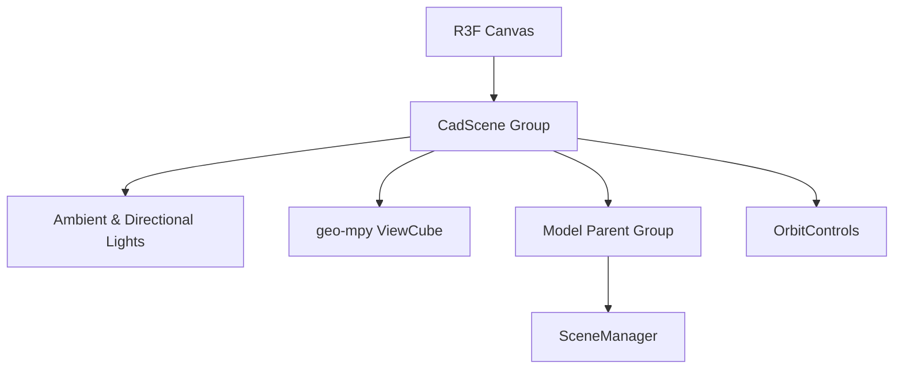

# Chapter 9: 3D CAD Scene Visualization System

Osdag-Web features an interactive 3D CAD scene renderer that allows developers and engineers to inspect calculated structural connections in real-time. The visualization system is built on **Three.js** and integrated with React using **React Three Fiber (R3F)** and **@react-three/drei**.

---

## 9.1 Three.js & React Three Fiber (R3F) Integration

The CAD visualization workspace is structured as a declarative Three.js canvas shell. The core renderer layout is declared in [CadScene.jsx](../frontend/src/modules/shared/components/cad/CadScene.jsx):



### 1. Viewport & Lighting
* **Lighting Rig**: The scene uses an ambient light source (`ambientLight` with intensity `1.0`) combined with two directional lights (a key light at `[10, 10, 10]` with intensity `1.0` and a secondary fill light at `[-10, 10, -10]` with intensity `0.4`).
* **Camera Controls**: Navigational orbit interactions are handled via the `<OrbitControls>` wrapper. A custom viewport `<ViewCube>` is placed in the top-right corner to allow axis-aligned alignment and focus snaps.

### 2. Camera Action Dispatcher
The camera responds to global window-level `cad-camera-action` events to support programmatic controls (such as toolbars or sidebar shortcuts):
* **Zoom actions**: Programmatically dolly camera offsets via `controls.dollyIn()` and `controls.dollyOut()`.
* **Pan actions**: Shift the camera target and position coordinate vectors along local vertical or horizontal axes.
* **Rotation lock**: Toggle the `<OrbitControls>` `autoRotate` property.
* **Axis views**: Align camera position offsets directly to front, top, or side orientations relative to the focal target.

---

## 9.2 SceneManager Architecture

The rendering pipeline is orchestrated by [SceneManager.jsx](../frontend/src/modules/shared/components/cad/SceneManager.jsx), which serves as the loading and caching boundary for geometry models.

### 1. Base64 STL & Text OBJ File Parsing
The backend computational engine outputs 3D models as base64-encoded binary STL formats or plain text OBJ models. 
* **STL Loading**: The `STLLoader` parses raw binary ArrayBuffers reconstituted from incoming base64 data:
  ```javascript
  const base64 = dataUrl.split(',')[1];
  const binary = atob(base64);
  const arrayBuffer = new Uint8Array(binary.length).map((_, i) => binary.charCodeAt(i)).buffer;
  const geometry = stlLoader.parse(arrayBuffer);
  const mesh = new THREE.Mesh(geometry);
  ```
* **OBJ Loading**: Text representations containing vertex (`v `) and face (`f `) specifications are processed statelessly by `OBJLoader.parse(dataUrl)`.

### 2. Geometry Lifecycle & Memory Disposal
To prevent GPU memory leaks when changing connection parameters or swapping active modules, `SceneManager` registers a cleanup hook. On unmount or model refresh:
* All compiled geometries are stored in an array of disposables.
* The cleanup routine traverses the geometry maps and explicitly calls `.dispose()` on all geometries and materials.
* The local model state is set to `null` to prompt garbage collection.

---

## 9.3 Part Customization & Mapping

Structural components (Beams, Columns, Plates, Bolts, Welds) must be mapped to distinct styles, render priorities, and active-view filters.

### 1. Style & Colors Configuration
Component visual profiles are defined in [partConfig.js](../frontend/src/modules/shared/components/cad/config/partConfig.js):
* **Default Color Palettes**: Maps string keys directly to hexadecimal strings (e.g. `Beam: "#C8C89E"`, `Column: "#909078"`, `Bolt: "#8B4513"`, `Weld: "#ff0000"`).
* **State Resolvers**: The `getPartColor` function resolves naming variations, ensuring that lowercased keys, capitalized names, and specific welded suffixes (such as `weld_left` or `weld_right`) map to their parent material colors.

### 2. Rendering Order & Transparency Layers
To avoid visual depth issues when rendering transparent plates or intersecting components, Osdag-Web divides the render stack into distinct categories:

| Layer Category | Render Order Value | Associated Components |
| :--- | :---: | :--- |
| **`STRUCTURAL`** | `0` (First) | Columns, Beams, Members |
| **`CONNECTOR`** | `1` (Middle) | Plates, Cleat Angles, Seated Angles, End Plates |
| **`FASTENER`** | `2` (Last/On Top) | Bolts, Welds, Anchors |

### 3. Active-View Part Filtering
The scene filters which parts display using `createViewMapper` declared in [viewMappings.js](../frontend/src/modules/shared/components/cad/config/viewMappings.js). When a specific viewport option is selected (e.g., "Plate"), the system queries the active configuration array and hides other component groups.

---

## 9.4 Module-Specific CAD Option Specifications

Each engineering module registers dynamic view options defining which tabs are displayed on the R3F canvas controls. These options are configured within each module's configuration schemas:

| Module Category | Engineering Module | CAD Option Selection List (`cadOptions`) |
| :--- | :--- | :--- |
| **Shear Connections** | Fin Plate | `["Model", "Beam", "Column", "Plate"]` |
| | End Plate | `["Model", "Beam", "Column", "Plate"]` |
| | Cleat Angle | `["Model", "Beam", "Column", "CleatAngle"]` |
| | Seated Angle | `["Model", "Beam", "Column", "SeatedAngle"]` |
| **Moment Connections** | Beam-to-Column End Plate | `["Model", "Beam", "Column", "EndPlate"]` |
| | Beam-to-Beam End Plate | `["Model", "Beam", "EndPlate"]` |
| | Column-to-Column End Plate | `["Model", "Column", "EndPlate"]` |
| | Column Cover Plate (Bolted) | `["Model", "Column", "CoverPlate"]` |
| | Column Cover Plate (Welded) | `["Model", "Column", "CoverPlate"]` |
| | Beam Cover Plate (Bolted) | `["Model", "Beam", "CoverPlate"]` |
| | Beam Cover Plate (Welded) | `["Model", "Beam", "CoverPlate"]` |
| **Simple Connections** | Lap Joint (Bolted) | `["Model", "Plate 1", "Plate 2", "Bolts"]` |
| | Lap Joint (Welded) | `["Model", "Plate 1", "Plate 2", "Welds"]` |
| | Butt Joint (Bolted) | `["Model", "Plate 1", "Plate 2", "Cover Plate", "Bolts"]` |
| | Butt Joint (Welded) | `["Model", "Plate 1", "Plate 2", "Cover Plate", "Welds"]` |
| **Tension Members** | Bolted to End Connection | `["Model", "Member", "Plate"]` |
| | Welded to End Connection | `["Model", "Member", "Plate"]` |
| **Compression Members**| Compression Member (General) | `["Model", "Member"]` |
| | Struts (Bolted) | `["Model", "Member", "Plate"]` |
| | Struts (Welded) | `["Model", "Member", "Plate"]` |
| | Axially Loaded Column | `["Model"]` |
| **Flexural Members** | Simply Supported Beam | `["Model"]` |
| | Cantilever Beam | `["Model"]` |
| | Purlin | `["Model", "Beam"]` |
| **Base Plate** | Base Plate Connection | `["Model", "Column", "Plate", "Welds", "Bolts", "Concrete", "Grout"]` |

---

## 9.5 SmartPart & Performance Optimization

Rendering highly detailed structural assemblies with hundreds of bolt threads or weld edges can cause performance degradation. [SmartPart.jsx](../frontend/src/modules/shared/components/cad/SmartPart.jsx) implements key optimization patterns to maintain 60 FPS:

### 1. Geometry Memoization for Edges
Creating a `THREE.EdgesGeometry` is a computationally expensive operation that computes adjacent vertex angles.
* **Optimization**: The edge geometries are cached using a `useMemo` block keyed to the mesh's core `geometry`. Edges are computed only once per loaded model rather than on every frame:
  ```javascript
  const edgesVisuals = useMemo(() => {
    if (!showEdges || !geometry) return null;
    const edgeGeo = new THREE.EdgesGeometry(geometry, 15); // Threshold 15 degrees
    const edgeMat = new THREE.LineBasicMaterial({ color: "black" });
    return { geometry: edgeGeo, material: edgeMat };
  }, [geometry, showEdges]);
  ```

### 2. Separation of Raycast Events
State-modifying events (hover updates) are split to bypass React's virtual DOM reconciliation loop:
* **Hover State Triggers (`onPointerOver`/`onPointerOut`)**: Update cursors and highlight states. Since these fire only once per hover entry/exit, state change overhead is kept minimal.
* **Coordinate Pointer Tracking (`onPointerMove`)**: Continuously monitors the cursor's coordinates to position the hover tooltip. Because pointer coordinate updates do *not* require updates to R3F node geometries, this tracking is decoupled from React's state triggers to prevent unnecessary rendering passes.

### 3. Material Memoization
The `meshPhongMaterial` is memoized and attaches declaratively. Standard mesh updates (such as hovering, opacity shifts, or selections) swap active materials or adjust parameters rather than rebuilding materials from scratch.

---

## 9.6 3D Component Hover & Tooltips

When a pointer hovers over a component part, the system translates the raycasted mesh metadata to resolve details from the backend's `hover_dict` schema.

```mermaid
graph TD
    HoverEvent[onPointerMove] --> MeshName[Read mesh.name: Connector]
    MeshName --> AliasResolution[Apply PART_ALIASES: Connector -> Plate]
    AliasResolution --> KeyLookup[Lookup hoverDict: hoverDict['Plate']]
    KeyLookup --> DisplayTooltip[Trigger onHover: display dimensions]
```

### 1. Semantic Part Name Aliasing
The backend computational engine outputs geometric mesh parts with names that differ from structural output naming conventions. To bridge this gap, `SmartPart` maps mesh names to their dictionary equivalents via `PART_ALIASES`:
* **`connector`**: Maps to `Bolt` or `Weld` (if fastener keys are present in the dictionary) or defaults to `Plate`.
* **`endplate`**: Maps to `Plate`.
* **`model`**: Resolves to `Column` or `Member` depending on connection profiles.
* **`cleatangle` / `seatedangle`**: Maps to `Cleat Angle` / `Seated Angle`.

### 2. Key Variations Fallback Loop
To ensure tooltips resolve successfully, the mapping logic attempts matches in a sequential loop:
1. Matches the exact name key (e.g. `CoverPlate`).
2. Checks lowercase equivalent keys (e.g. `coverplate`).
3. Checks capitalized string versions (e.g. `Coverplate`).
4. Attempts singular/plural variations (e.g. resolving `Bolts` to `Bolt` or vice-versa).
5. Resolves semantic translations using configured `PART_ALIASES`.

---

## 9.7 Observations & Areas of Improvement

During the architectural review of the 3D rendering pipeline, the following items were identified and resolved:

### 1. WebGL Context Loss Recovery (Resolved)
* **The Problem:** The React Three Fiber canvas context did not register listeners for `webglcontextlost` events. If a user's system ran out of GPU memory or woke up from system sleep, the 3D canvas would crash and show a black frame.
* **The Risk:** Once crashed, the renderer would remain broken until the user manually refreshed the entire webpage, potentially losing current form inputs or calculated logs.
* **Resolution:** Added a native `webglcontextlost` event listener in the `onCreated` callback of the R3F `<Canvas>` in [CadViewer.jsx](../frontend/src/modules/shared/components/CadViewer.jsx#L49-L60). When triggered, it calls `event.preventDefault()` to allow context recovery and increments a state-driven key `canvasKey` on the Canvas component to force-re-mount a clean WebGLRenderer instance automatically.

### 2. Pointer Event Race Hazards (Resolved)
* **The Problem:** In `SceneManager.jsx`, the hover exit function `handlePartHoverEnd` was checked using a simple state variable match: `if (hoveredMeshId === meshId)`.
* **The Risk:** If a user moved their mouse rapidly across multiple components, pointer-out events could be processed out of order or fire with stale closures. This caused the hovered state to become locked on a specific part even after the mouse had moved away.
* **Resolution:** Implemented the "latest ref" pattern by tracking the current hover mesh ID inside a `hoveredMeshIdRef` in [SceneManager.jsx](../frontend/src/modules/shared/components/cad/SceneManager.jsx#L28-L30). [handlePartHover](file:///home/abhijith/coding/osdag/Osdag-web/frontend/src/modules/shared/components/cad/SceneManager.jsx#L181-L186) and [handlePartHoverEnd](file:///home/abhijith/coding/osdag/Osdag-web/frontend/src/modules/shared/components/cad/SceneManager.jsx#L188-L194) now read and write to this ref synchronously. Since the callback only reads from the ref, it does not suffer from stale React state closures during rapid pointer actions.

