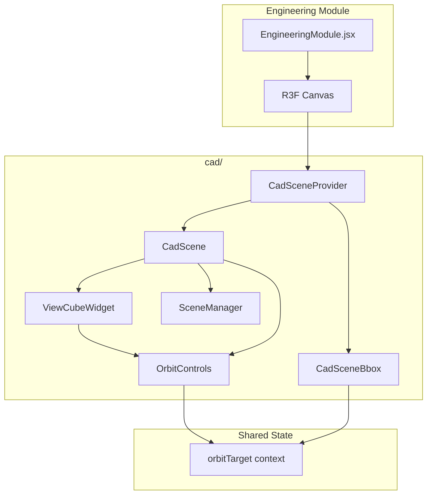
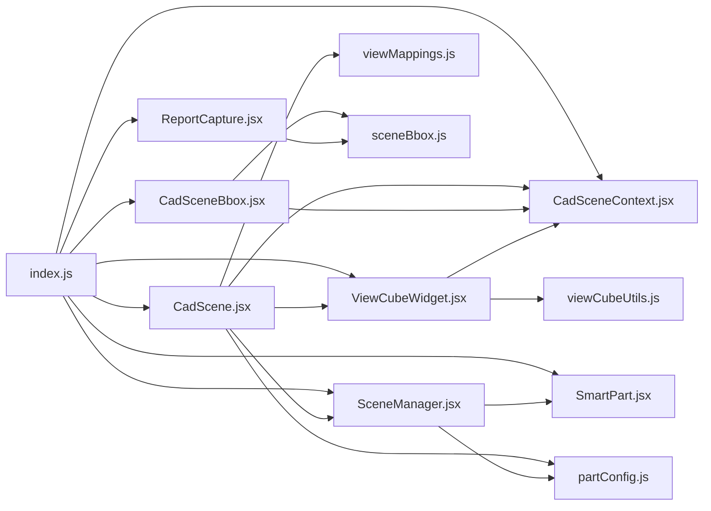

# Osdag Web — CAD Module Documentation

**Version:** 1.0 (March 2026)  
**Location:** `frontend/src/modules/shared/components/cad/`  
**Purpose:** Browser-based 3D visualization of structural steel connection and member models using **React Three Fiber (R3F)**, **Three.js**, and **@react-three/drei**.

This document describes architecture, data flow, configuration, and extension points for maintainers and contributors. Target audience: engineers and developers working on the Engineering Module and design-report pipelines.

---

## Table of Contents

1. [Executive Summary](#1-executive-summary)
2. [Technology Stack](#2-technology-stack)
3. [Directory Layout](#3-directory-layout)
4. [High-Level Architecture](#4-high-level-architecture)
5. [Module Public API (`index.js`)](#5-module-public-api-indexjs)
6. [Scene Graph & Rendering Pipeline](#6-scene-graph--rendering-pipeline)
7. [`CadScene.jsx` — Root Scene Assembly](#7-cadscenejsx--root-scene-assembly)
8. [`CadSceneContext` — Orbit Target State](#8-cadscenecontext--orbit-target-state)
9. [`CadSceneBbox` — Framing & Orbit Center](#9-cadscenebbox--framing--orbit-center)
10. [`SceneManager.jsx` — Model Loading & Part Instantiation](#10-scenemanagerjsx--model-loading--part-instantiation)
11. [`SmartPart.jsx` — Per-Mesh Rendering & Hover](#11-smartpartjsx--per-mesh-rendering--hover)
12. [`config/partConfig.js` — Colors & Render Order](#12-configpartconfigjs--colors--render-order)
13. [`config/viewMappings.js` — View ↔ Part Visibility](#13-configviewmappingsjs--view--part-visibility)
14. [`hooks/useViewCamera.js` — Grid Camera Presets](#14-hooksuseviewcamerajs--grid-camera-presets)
15. [`utils/sceneBbox.js` — Bounding Box & Camera Distance](#15-utilsscenebboxjs--bounding-box--camera-distance)
16. [`widgets/ViewCubeWidget.jsx` — Navigation Cube](#16-widgetsviewcubewidgetjsx--navigation-cube)
17. [`widgets/viewCubeUtils.js` — Cube Geometry & Snap Math](#17-widgetsviewcubeutilsjs--cube-geometry--snap-math)
18. [`ReportCapture.jsx` — Screenshots & Report Views](#18-reportcapturejsx--screenshots--report-views)
19. [Integration with `EngineeringModule.jsx`](#19-integration-with-engineeringmodulejsx)
20. [Custom Events: `cad-camera-action`](#20-custom-events-cad-camera-action)
21. [Comparison with Desktop Osdag (Open CASCADE)](#21-comparison-with-desktop-osdag-open-cascade)
22. [Performance Considerations](#22-performance-considerations)
23. [Troubleshooting](#23-troubleshooting)
24. [Extension Guide](#24-extension-guide)
25. [Quick Reference Tables](#25-quick-reference-tables)
26. [Appendix: File Dependency Graph](#appendix-file-dependency-graph)

---

## 1. Executive Summary

The CAD module renders **STL/OBJ** geometry delivered from the Django backend as **data URLs** or text. It supports:

- **Multi-part assemblies** (Beam, Column, Plate, Bolts, Welds, etc.) with **per-part colors** and **render order** (structural behind, fasteners on top).
- **Section-based visibility** (“Model”, “Plate 1”, “Beam”, …) driven by **`moduleCadConfig`**.
- **Orbit camera** around a **computed bounding-box center**, with **pan/zoom** via toolbar events.
- **View cube** (AIS_ViewCube–style) for orientation, face snapping, **180° yaw** flip, and sync with the main camera.
- **Bounding-box–based** initial framing and **report view capture** (iso, front, side, top) for PDF reports.

The module is **not** a full CAD editor: it is a **viewer** with navigation and export hooks.

---

## 2. Technology Stack

| Layer | Library | Role |
|-------|---------|------|
| UI | React | Components, hooks |
| 3D | `three` | Scenes, meshes, math |
| R3F | `@react-three/fiber` | Declarative Three.js, `Canvas`, `useFrame`, `useThree` |
| Helpers | `@react-three/drei` | `OrbitControls`, `useCursor`, etc. |
| Loaders | `STLLoader`, `OBJLoader` (three/examples) | Parse backend geometry |

---

## 3. Directory Layout

```
cad/
├── CAD_MODULE.md              ← This documentation
├── index.js                   ← Public exports
├── CadScene.jsx               ← Lights, OrbitControls, ViewCube, SceneManager
├── CadSceneBbox.jsx           ← BBox + orbit target + initial camera (non-grid)
├── SceneManager.jsx           ← Load STL/OBJ, split meshes, SmartPart instances
├── SmartPart.jsx              ← Single mesh + edges + hover
├── ReportCapture.jsx          ← Screenshot + dev report capture helpers
├── context/
│   └── CadSceneContext.jsx    ← orbitTarget [x,y,z]
├── hooks/
│   └── useViewCamera.js       ← Grid view fixed camera positions
├── config/
│   ├── partConfig.js          ← Default colors, render order, VALID_PART_KEYS
│   └── viewMappings.js        ← View name → visible parts
├── utils/
│   └── sceneBbox.js           ← computeSceneBoundingBox, distanceForFov
└── widgets/
    ├── ViewCubeWidget.jsx     ← Drei Hud view cube + interactions (single gl)
    └── viewCubeUtils.js       ← Labels, snapFromCoord, geometry constants
```

---

## 4. High-Level Architecture



**Data flow (geometry):**  
Backend JSON → `modelPaths` map (part name → data URL / OBJ string) → `SceneManager` parses → `SmartPart` meshes → R3F scene.

**Data flow (camera):**  
`CadSceneBbox` computes world bbox → `setOrbitTarget(center)` → `OrbitControls` `target` prop → user navigation / view cube updates camera → `CadSceneBbox` can reposition for non-grid views when `modelKey` changes.

---

## 5. Module Public API (`index.js`)

| Export | Description |
|--------|-------------|
| `CadScene` | Main 3D scene content (place inside `<Canvas>`) |
| `SceneManager` | Loads models; may be used standalone but normally inside `CadScene` |
| `SmartPart` | Single-part mesh wrapper |
| `ScreenshotCapture`, `ReportCaptureDev` | Snapshot / dev helpers |
| `useViewCamera` | Hook returning `{ position }` for legacy grid camera |
| `ViewCubeWidget` | Standalone view cube (normally internal to `CadScene`) |
| `CadSceneProvider`, `useCadSceneContext` | Orbit center state |
| `CadSceneBbox` | Bounding-box setup component |

---

## 6. Scene Graph & Rendering Pipeline

1. **Lights** — `CadScene` adds ambient, directional, point, spot lights for readable PBR-style shading on `meshPhysicalMaterial`.
2. **ViewCubeWidget** — Renders the navigation cube inside **Drei `Hud`** (same WebGL context as the main scene). The HUD orthographic camera draws after the main scene with a depth clear; **drei `Html`** stacks **↻**, **+** / **−** (zoom main model), and a hint around the cube. The widget drives the **main** camera via refs when interacting with the cube; when idle, the cube **mirrors** the main camera quaternion.
3. **SceneManager** — Adds a `THREE.Group` with all `SmartPart` children.
4. **OrbitControls** — Attached to the **default R3F camera**; `target` bound to orbit context. **`enableRotate`** is **on** so the user can **orbit the main model** with pointer drag on the canvas; **pan**/**zoom** behave per Drei defaults. The view cube stays in sync when not dragging the cube (see §16).

---

## 7. `CadScene.jsx` — Root Scene Assembly

**File:** `CadScene.jsx`

### Props

| Prop | Type | Description |
|------|------|-------------|
| `modelPaths` | `object` | Map of part keys to STL data URLs or OBJ text |
| `selectedView` | `string` | Primary section (e.g. `"Model"`) |
| `selectedViews` | `string[]` | Optional multi-select; defaults to `[selectedView]` |
| `cameraSettings` | `object` | `modelPosition`, `modelScale`, `orthographicView`, `connectivity` |
| `hoverDict` | `object` | Map mesh keys → human-readable hover labels |
| `onHoverLabel`, `onHoverEnd` | `function` | Hover callbacks for tooltips |
| `moduleCadConfig` | `object` | Per-module `partColors`, `renderOrder`, `viewMappings`, `cadOptions` |

### Grid views

`GRID_VIEWS = ["XY","YZ","ZX","ANGLE1",…,"ANGLE6"]` — when `primaryView` is one of these, **model position** is forced to `[0,0,0]` for alignment with grid-based camera presets.

### Memoized mappers

- `shouldShowPart` — from `createViewMapper(moduleCadConfig)`.
- `getPartRenderOrder`, `getColorForPart` — from `partConfig.js`.

### `cad-camera-action` listener

`document` listens for **CustomEvent** `cad-camera-action` with `e.detail` in:

- `'zoom-in'`, `'zoom-out'` — `dollyIn` / `dollyOut` (factor 1.2) via `CadScene`; **+** / zoom-in should show a **larger** model, **−** / zoom-out a smaller one.
- `'pan-up'`, `'pan-down'`, `'pan-left'`, `'pan-right'` — shifts `target` and camera by `0.05` world units

**Sources:** the module toolbar and **ViewCubeWidget** HUD **+** / **−** buttons dispatch the same events (see §16).

After each programmatic change, **`syncOrbitControlsFromCamera(controls)`** (from `viewCubeUtils.js`) keeps OrbitControls internals aligned.

---

## 8. `CadSceneContext` — Orbit Target State

**File:** `context/CadSceneContext.jsx`

- **State:** `orbitTarget` — `[x, y, z]` world position (default `[0,0,0]`).
- **Setter:** `setOrbitTarget([x,y,z])` — called by `CadSceneBbox` after bbox computation.
- **Consumer:** `CadScene` passes `target={orbitTarget}` to `OrbitControls`; `ViewCubeWidget` uses it for **orbit radius** and **snap** when `controlsRef` is missing.

**Important:** `OrbitControls` expects a **Three.js `Vector3`** in some Drei versions; the code passes a **plain array** — Drei typically coerces; verify if upgrading.

---

## 9. `CadSceneBbox` — Framing & Orbit Center

**File:** `CadSceneBbox.jsx`

**Props:** `modelKey` (invalidation key), `selectedCameraView` (grid vs. orbit).

**Behavior:**

1. `requestAnimationFrame` → `computeSceneBoundingBox(scene)` from `sceneBbox.js`.
2. `setOrbitTarget([center.x, center.y, center.z])`.
3. If **not** a grid view: compute camera distance via `distanceForFov(size, fovDeg)`, clamp with `DEFAULT_DISTANCE`, place camera on **iso direction** `(1,1,1).normalize()`, `lookAt(center)`.

**Grid views:** Skip camera reposition so external/grid logic (e.g. `useViewCamera`) can dominate.

---

## 10. `SceneManager.jsx` — Model Loading & Part Instantiation

**File:** `SceneManager.jsx`

### Loading pipeline

1. **STL:** `data:application/...` base64 → `STLLoader.parse` → `THREE.Mesh` per key.
2. **OBJ:** String containing `'v '` → `OBJLoader.parse` → `Group`.
3. **Aggregation:** Meshes whose keys are in `VALID_PART_KEYS` are merged into a **`partsGroup`**; if no `Model` key, `parsedData.Model = partsGroup`.
4. **Cleanup:** On unmount or `modelPaths` change, geometries/materials disposed.

### Rendering strategy

Two paths (deduplicated):

1. **Primary:** Traverse `parsedModels.Model` meshes → one `SmartPart` per mesh (name from mesh).
2. **Fallback:** Dedicated keys in `geometries` object (`beam`, `column`, …) if not already in `modelPartNamesLower`.

### Special positions

- `Member`, `EndPlate`/`Endplate`: `position [0, 0, 4]` (offset along Z in scaled space).
- `CleatAngle`, `SeatedAngle`, `Connector`, `CoverPlate`: `z + 1` offset.
- **Column Web-Beam-Web:** `rotation [0, -π/2, 0]` instead of default `modelRotation`.

### `forwardRef`

Exposes the **root `THREE.Group`** for imperative access (`groupRef.current`).

---

## 11. `SmartPart.jsx` — Per-Mesh Rendering & Hover

**File:** `SmartPart.jsx`

### Features

- **`meshPhysicalMaterial`** — clearcoat, metalness, roughness; hover brightens green tint.
- **`EdgesGeometry`** — angle threshold 15°; black lines; hover lightens edges.
- **Hover resolution** — `hoverDict` key variants (exact, lower, capitalized, singular/plural).
- **Events:** `onPointerOver` / `onPointerOut`/`onPointerMove` with `stopPropagation` to avoid bubbling through stacked meshes.

### Performance

- Memoized `geometry` for edges (`useMemo` on `[geometry, showEdges]`).
- `meshMaterial` memoized to avoid recompilation every frame.

---

## 12. `config/partConfig.js` — Colors & Render Order

**Defaults:** `DEFAULT_PART_COLORS` — structural greens/grays, plates dark, bolts brown, welds red.

**Render layers:** `RENDER_ORDER` — STRUCTURAL (0), CONNECTOR (1), FASTENER (2). Higher draws on top.

**`getPartColor(partName, moduleCadConfig)`** — module override → exact → case variants → weld prefix → `#888888`.

**`getRenderOrder(partName, moduleCadConfig)`** — module override → keyword heuristics.

**`VALID_PART_KEYS`** — STL keys eligible for `partsGroup` aggregation.

---

## 13. `config/viewMappings.js` — View ↔ Part Visibility

**`DEFAULT_VIEW_MAPPINGS`:** e.g. `"Model" → "all"`, `"Plate" → ["Plate","Bolt","Bolts"]`, simple-connection keys `"Plate 1"`, `"Welds"`, etc.

**`createViewMapper(moduleCadConfig)`:**

- Merges `moduleCadConfig.viewMappings`.
- **Simple-connection tweak:** if `cadOptions` includes `"Plate 1"`, `Model` maps to **all cadOptions except `"Model"`** so combined meshes don’t duplicate a monolithic `Model` STL.

**`getViewOptions`** — `moduleCadConfig.viewOptions` or `moduleConfig.cadOptions` or default `["Model","Beam","Connector"]`.

---

## 14. `hooks/useViewCamera.js` — Grid Camera Presets

Returns `{ position }` for fixed positions:

- `XY` → `[0,40,0]`, `YZ` → `[40,0,0]`, `ZX` → `[0,0,40]`
- `ANGLE1` … `ANGLE6` — ±30° style diagonals
- Default → `[30,30,30]`

**Note:** This hook does **not** drive `OrbitControls` directly in all code paths; **parent** must apply `position` to the camera when using grid mode. Coordinate with `CadSceneBbox` grid detection.

---

## 15. `utils/sceneBbox.js` — Bounding Box & Camera Distance

**`computeSceneBoundingBox(scene)`**

- `scene.updateMatrixWorld(true)`
- Union of all `Mesh` geometry bounding boxes in world space
- Returns `{ center, size }` or `null`

**`distanceForFov(size, fovDeg, paddingFactor)`**

- Uses **half diagonal** of bbox as conservative radius
- `distance = (halfDiagonal / tan(fov/2)) * PADDING_FACTOR` (default **2.2** padding)
- `DEFAULT_DISTANCE = 20` fallback

Used by **`CadSceneBbox`** and **`ReportCapture`**.

---

## 16. `widgets/ViewCubeWidget.jsx` — Navigation Cube

### Purpose

Interactive **26-facet** cube (faces + edges + corners) rendered in **Drei `Hud`** (`renderPriority={1}`) so the HUD pass draws the main scene first, then clears depth and draws the orthographic cube overlay—**one** WebGL context, one frame loop. When idle, the cube group **mirrors** **`mainCamera.quaternion`** (same convention as **`applyCubeQuaternionToOrbitCamera`**). Face snap uses **`snapFromCoord`** pole handling aligned with **Three.js `lookAt`** (see §17) so roll matches orbit navigation and TOP/BOTTOM are not inverted relative to the live camera.

### Key mechanisms

1. **`applyCubeQuaternionToOrbitCamera` / `syncOrbitControlsFromCamera` / `getOrbitDistance`** — Implemented in `viewCubeUtils.js`. After moving the camera, **`syncOrbitControlsFromCamera(controls)`** calls `controls.update()`. Radius uses **`getOrbitDistance(controls)`** (`getDistance()` when available, else `distanceTo(target)`).

2. **Drag** — **AIS_ViewCube / OCCT-style arcball (Shoemake)**: pointer position in the **150×150 px** widget maps to **P₀, P₁** on a unit sphere via `projectOnTrackball` (hemisphere + hyperbola branch at `d > 1/√2`). Each move: **`setFromUnitVectors(P₀, P₁)`**, **`group.quaternion.premultiply(dragQuat)`** (world-first), then **P₀ ← P₁** so the touched surface follows the cursor (not velocity × constant). **`syncDragFromCube`** runs after each step so the main camera matches immediately; `useFrame` still syncs while dragging. **Pointer capture** on down keeps events when the cursor leaves the widget. **Canvas-local** coords: `clientToCubeLocal` + layout center. Orbit **radius frozen** on pointer down.

3. **Face click** — `snapFromCoord` → perspective `lookAt` → **`toQuat = _tempPersp.quaternion`** (same storage as idle); **OrbitControls** is **`enabled = false`** for the snap so Drei’s per-frame `update()` does not overwrite the camera from spherical coords (critical for ±Y). **Fixed-duration** snap (**`SNAP_MS`**, ~350ms) with **ease-in-out cubic** `slerp` on the **cube group** quaternion, then `applyCubeQuaternionToOrbitCamera` each frame until `t ≥ 1`. On completion, **`group.quaternion.copy(camera.quaternion)`**, **`controls.enabled = true`**, and **`syncOrbitControlsFromCamera`** again.

4. **180° button (↻)** — `premultiply` π about **world Y**; clears snap; orbit update + `syncOrbitControlsFromCamera`.

5. **UI** — **drei `Html`**: a **vertical column** above the cube (HUD world **+Y**): **↻** (180°), then **+** / **−** zoom (dispatch `cad-camera-action` for the **main** camera only); hint text **below** the cube. Vertical placement uses a **mesh half-extent** constant (`CUBE_MESH_HALF_WORLD` in code) plus small pixel gaps so the stack sits **near the cube mesh**, not at the top of the full 150px layout box.

### Constants (excerpt)

- `SNAP_MS` — wall-clock snap duration; `CUBE_PX` — layout size and trackball mapping.

### Memory

- Dispose `geometry`, `material`, **`material.map`** on unmount (`useEffect` cleanup for procedural meshes).

### Manual QA (regression)

- Canvas **orbit drag** (main model rotates; cube follows when idle); drag cube vs main alignment; face / edge snap; 180° flip; HUD **+**/**−** and toolbar zoom/pan (`cad-camera-action`); window resize; design report capture if it depends on camera.

---

## 17. `widgets/viewCubeUtils.js` — Cube Geometry & Snap Math

**Geometry constants:** `VC_OFFSET`, `VC_FACE_W`, face/edge/corner dimensions, colors.

**`VC_LABELS`** — Maps grid coord `"0,0,1"` → `"FRONT"`, etc. **`1,0,0`** → **RIGHT**, **`−1,0,0`** → **LEFT** (world +X / −X).

**`makeLabelTexture(text)`** — Canvas → `CanvasTexture` for face labels.

**`snapFromCoord([cx,cy,cz])`** — Unit **position** on the view sphere (camera at `target + position * radius`). **`up`** for `lookAt` uses world **`(0,1,0)`** when not singular; at **±Y** poles, **TOP** uses **`(0,0,1)`** and **BOTTOM** **`(0,0,-1)`** so the two views stay distinct; if still parallel to **forward**, **`(1,0,0)`**.

**`applyCubeQuaternionToOrbitCamera`**, **`getOrbitDistance`**, **`syncOrbitControlsFromCamera`**, **`easeInOutCubic`** — Shared orbit/camera helpers for the view cube and toolbar sync.

**`projectOnTrackball(localX, localY, canvasSize, out)`** — Maps widget-local pixels to a unit vector on the virtual trackball sphere (hemisphere + hyperbola branch outside the disk).

---

## 18. `ReportCapture.jsx` — Screenshots & Report Views

**`ScreenshotCapture`**

- On `screenshotTrigger` + `Model` view: `toBlob` / save dialog via File System Access API or fallback download.

**`ReportCaptureDev`** (development)

- Registers **`window.captureReportViews()`** (returns `{ iso, front, side, top }` data URLs), **`downloadReportViews()`**, **`setCameraToTopView()`**.
- Uses same **bbox center** and **distance** heuristics as `sceneBbox.js`.
- Directions: iso `(1,1,1)`, front `(0,0,1)`, side `(1,0,0)`, top `(0,1,0)` — normalized.

---

## 19. Integration with `EngineeringModule.jsx`

Typical structure:

```jsx
<CadSceneProvider>
  <CadScene ... />
  <CadSceneBbox modelKey={...} selectedCameraView={...} />
</CadSceneProvider>
```

Both must be **inside** the same `<Canvas>` tree so `useThree()` / context work.

`modelPaths` usually comes from backend CAD generation after design run. **`moduleCadConfig`** is resolved per module (shear, moment, simple connection, etc.).

---

## 20. Custom Events: `cad-camera-action`

Toolbar, parent, or **ViewCubeWidget** HUD zoom buttons dispatch:

```js
document.dispatchEvent(new CustomEvent('cad-camera-action', { detail: 'zoom-in' }));
```

Handled in `CadScene` as described in §7.

---

## 21. Comparison with Desktop Osdag (Open CASCADE)

| Aspect | Desktop (`osdag_gui`, `AIS_ViewCube`) | Web (`ViewCubeWidget`) |
|--------|----------------------------------------|-------------------------|
| Cube implementation | OCCT native, **one** `V3d_View` | **Drei `Hud`** + same `gl` as main scene |
| Drag on cube | `super().mouseMoveEvent` → OCCT internals | Custom quaternion + `applyCubeQuaternionToOrbitCamera` |
| Main rotate | `view.StartRotation` / `Rotation` | Canvas **OrbitControls** rotate + cube mirrors when idle |
| Feel | Single tuned pipeline | Virtual trackball drag + fixed-duration snap |

**Optional future work:** migrating the main navigator to **`@react-three/drei` `CameraControls`** would replace a large surface area (`OrbitControls`, bbox, toolbar, `ReportCapture`). Only consider after the current HUD + snap + orbit-sync behavior is stable; **not** required for basic parity.

---

## 22. Performance Considerations

1. **STL parsing** — synchronous on main thread; large models may jank.
2. **Edges** — `EdgesGeometry` per mesh; disable `showEdges` if profiling shows cost.
3. **Hover** — `onPointerMove` fires often; parent should avoid heavy `setState` work.
4. **HUD overlay** — View cube shares the main `gl`; `Hud` renders after the default scene with a depth clear (minimal extra cost vs a second context).
5. **Memoization** — `SceneManager`/`SmartPart` rely on memoization; avoid new `moduleCadConfig` object identity every render unless needed.

---

## 23. Troubleshooting

| Symptom | Likely cause | Check |
|---------|--------------|-----|
| Blank canvas | No meshes in `modelPaths` / parse failure | Console, network, STL base64 |
| Wrong colors | Part name mismatch | `moduleCadConfig.partColors`, `getPartColor` |
| Parts missing | View filter | `viewMappings`, `shouldShowPart` |
| Camera inside model | Bad scale / bbox | `modelScale`, `CadSceneBbox` |
| Cube not syncing | `controlsRef` null | `CadScene` mounts `OrbitControls` before cube |
| Report images empty | Capture not sent to API | `captureReportViews` payload, backend `images` |

---

## 24. Extension Guide

### Add a new part color

1. Add key to `DEFAULT_PART_COLORS` or `moduleCadConfig.partColors`.
2. If new STL section name, add to `VALID_PART_KEYS` if it should merge into `Model`.

### Add a new view section

1. Add `viewMappings` entry (array of part names or `"all"`).
2. Add `cadOptions` in module config if it appears in UI dropdown.

### Add a navigation control

1. Prefer **CustomEvent** or **callback props** from `CadScene` to avoid duplicating camera logic.
2. Any rotation should update **orbit-consistent** position + `lookAt` like `applyCubeQuaternionToOrbitCamera`.

---

## 25. Quick Reference Tables

### `cameraSettings` (typical)

| Field | Meaning |
|-------|---------|
| `modelPosition` | `[x,y,z]` offset for parts (unless grid) |
| `modelScale` | Uniform scale (default `0.008`) |
| `orthographicView` | Optional named ortho preset (legacy) |
| `connectivity` | e.g. `"Column Web-Beam-Web"` for rotation tweak |

### `moduleCadConfig` (typical)

| Field | Meaning |
|-------|---------|
| `partColors` | `{ PartName: "#hex" }` |
| `renderOrder` | `{ PartName: number }` |
| `viewMappings` | `{ ViewName: ["Part", ...] \| "all" }` |
| `cadOptions` | Dropdown list; interacts with `Model` mapping |
| `viewOptions` | Override list for UI |

---

## Appendix: File Dependency Graph



---

## Document History

| Date | Note |
|------|------|
| 2026-03 | Initial CAD module documentation (500+ lines) |

---

## Additional Notes for Contributors

### Coordinate system

- **Three.js** default: **Y-up**, **−Z** forward for camera look direction in `applyCubeQuaternionToOrbitCamera` (uses `(0,0,-1)` as view direction).
- **Model rotation** in `CadScene`: `[Math.PI / -2, 0, 0]` — **−90°** about X to align typical CAD/engineering exports to the web convention.

### Testing checklist (manual)

1. Load module with `Model` path — all parts visible.
2. Switch sections — visibility matches `viewMappings`.
3. Orbit with view cube — main model rotates smoothly; no snap-back.
4. Face click on cube — animates to FRONT/TOP/etc.
5. Flip 180° — opposite side visible.
6. **CadSceneBbox** — frame contains full model; orbit target at center.
7. **Design report** — if wired, `captureReportViews` produces four PNGs.

### Code style

- Prefer **refs** for values needed in DOM listeners inside `useEffect` (`controlsRefBox`, `mainCameraRef`, `orbitTargetRef`).
- **Dispose** GPU resources in `useEffect` cleanups.

### Security

- STL/OBJ from backend should be **trusted**; parsing is not sandboxed.
- `ReportCapture` file picker requires **secure context** (HTTPS or localhost).

### Accessibility

- View cube hint and flip button **`aria-label`** / **`title`**.
- Keyboard navigation for canvas is **limited**; consider adding keyboard shortcuts for orbit if required by WCAG roadmap.

### Future improvements (non-exhaustive)

1. **Optional `CameraControls`** migration (large refactor; see §21).
2. **Unify** drag sensitivity with main view arcball.
3. **Instancing** for repeated bolts (if performance requires).
4. **Web Worker** STL parsing for large files.
5. **Draco** or **meshopt** compression if backend supports.

---

## Glossary

| Term | Definition |
|------|------------|
| **R3F** | React Three Fiber — React renderer for Three.js |
| **Orbit** | Camera rotation around a fixed **target** point |
| **Data URL** | `data:application/...;base64,...` for inline STL |
| **STL** | Stereolithography mesh format (triangles) |
| **OBJ** | Wavefront text format with vertices and faces |
| **Snap** | Animated alignment to a standard view direction |
| **BBox** | Axis-aligned bounding box |

---

## Section Index (Line-Oriented Maintenance)

For large refactors, search this file for:

- **§7** — `CadScene` props and events  
- **§10** — SceneManager loading  
- **§16** — ViewCube behavior  
- **§18** — Report capture  

---

## Detailed Prop Flow: `CadScene` → `SceneManager`

```
modelPaths
  │
  ├─► SceneManager useEffect
  │     ├─ STLLoader / OBJLoader
  │     ├─ VALID_PART_KEYS filter → partsGroup
  │     └─ setParsedModels
  │
  └─► shouldShowPart(name) for each mesh
        └─ createViewMapper(moduleCadConfig)(name, activeViews)

getColorForPart(name) / getPartColor(name, moduleCadConfig)
getPartRenderOrder(name) / getRenderOrder(name, moduleCadConfig)
```

---

## Detailed Camera Flow

```
CadSceneBbox (useEffect, rAF)
  └─ computeSceneBoundingBox(scene)
       └─ setOrbitTarget(center)

CadScene
  └─ OrbitControls target={orbitTarget from context}

ViewCubeWidget (useFrame, priority 0 — before Hud render pass)
  ├─ if snap: ease-in-out slerp cube quat over SNAP_MS; applyCubeQuaternionToOrbitCamera + syncOrbitControlsFromCamera
  ├─ else if drag: applyCubeQuaternionToOrbitCamera + syncOrbitControlsFromCamera
  └─ else: cubeGroup.quaternion.copy(mainCamera.quaternion)

Drei Hud (useFrame priority 1)
  └─ render main scene, clear depth, render HUD ortho cube + Html
```

---

## Constants Reference (View Cube)

| Constant | Typical value | Role |
|----------|---------------|------|
| `SNAP_MS` | `350` | Wall-clock snap duration (ease-in-out cubic) |
| `CUBE_PX` | `150` | Cube widget size (px) for layout & trackball mapping |
| `DRAG_THRESHOLD_PX` | `5` | Click vs drag on face |
| `VC_ORTHO_SIZE` | `3.1` | Ortho frustum half-extent (world units at reference layout) |

---

## Constants Reference (Scene Bbox)

| Constant | Value | Role |
|----------|-------|------|
| `DEFAULT_DISTANCE` | `20` | Minimum camera distance fallback |
| `PADDING_FACTOR` | `2.2` | Margin on FOV-based distance |

---

## End of CAD Module Documentation

*This file is the canonical reference for the `cad/` package. When adding features, update the relevant section and the dependency graph.*
